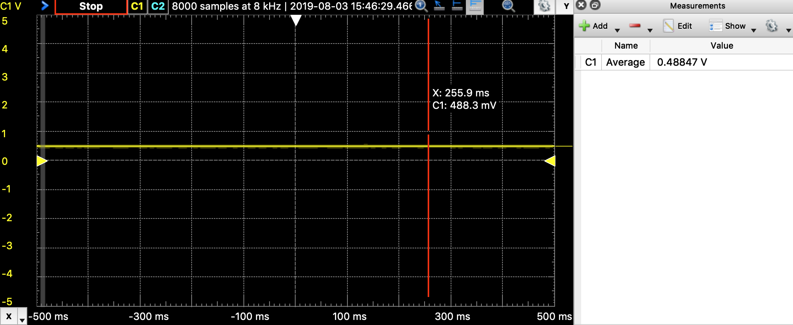
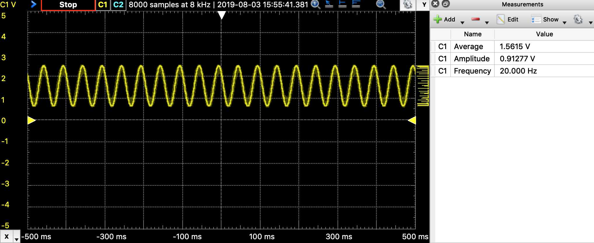
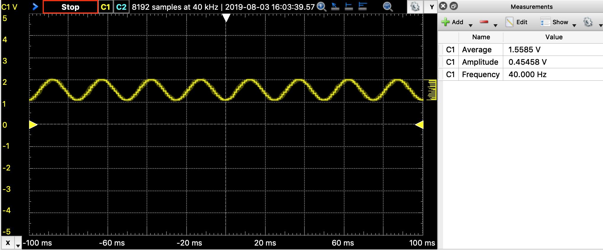

# uPydev docs

<!-- TOC depthFrom:1 depthTo:6 withLinks:1 updateOnSave:1 orderedList:0 -->

- [uPydev Mode/Tools:](#upydev-modetools)
	- [config](#config)
	- [put](#put)
	- [get](#get)
	- [sync](#sync)
	- [cmd](#cmd)
	- [wrepl](#wrepl)
	- [ping](#ping)
	- [run](#run)
	- [install](#install)
	- [mpyx](#mpyx)
	- [timeit](#timeit)
	- [fw](#fw)
	- [flash](#flash)
	- [see](#see)
	- [make_group](#make_group)
- [GROUP COMMAND MODE](#group-command-mode)
- [GROUP COMMAND PARALLEL MODE](#group-command-parallel-mode)
- [upy Commands:](#upy-commands)
	- [GENERAL](#general)
		- [info](#info)
		- [id](#id)
		- [upysh](#upysh)
		- [reset](#reset)
		- [uhelp](#uhelp)
		- [umodules](#umodules)
		- [mem_info](#mem_info)
		- [filesize](#filesize)
		- [filesys_info](#file_sysinfo)
		- [netinfo](#netinfo)
		- [netinfot](#netinfot)
		- [netscan](#netscan)
		- [netstat_on](#netstat_on)
		- [netstat_off](#netstat_off)
		- [netstat_conn](#netstat_conn)
		- [netstat](#netstat)
		- [ap_on](#ap_on)
		- [ap_off](#a_poff)
		- [apstat](#apstat)
		- [apconfig](#apconfig)
		- [apscan](#apscan)
		- [i2c_config](#i2c_config)
		- [i2c_scan](#i2c_scan)
		- [spi_config](#spi_config)
		- [set_localtime](#set_localtime)
		- [set_ntptime](#set_ntptime)
		- [get_datetime](#get_datetime)
	- [SD](#sd)
		- [sd_enable](#sdenable)
		- [sd_init](#sd_init)
		- [sd_deinit](#sd_deinit)
		- [sd_auto](#sd_auto)
	- [INPUT](#input)
		- [ADC](#adc)
			- [adc_config](#adc_config)
			- [aread](#aread)
		- [EXTERNAL ADC](#external-adc)
			- [ads_init](#ads_init)
			- [ads_read](#ads_read)
		- [IMU](#imu)
			- [imu_init](#imu_init)
			- [imuacc](#imuacc)
			- [imuacc_sd](#imuacc_sd)
			- [imugy](#imugy)
			- [imumag](#imumag)
		- [WEATHER SENSOR: (BME280)](#weather-sensor-bme280)
			- [bme_init](#bme_init)
			- [bme_read](#bme_read)
		- [POWER SENSOR: (INA219)](#power-sensor-ina219)
			- [ina_init](#ina_init)
			- [ina_read](#ina_read)
			- [ina_batt](#ina_batt)
	- [OUTPUT](#output)
		- [DAC](#dac)
			- [dac_config](#dac_config)
			- [dac_write](#dac_write)
			- [dac_sig](#dac_sig)
		- [BUZZER:](#buzzer)
			- [buzz_config](#buzz_config)
			- [buzz_set_alarm](#buzz_set_alarm)
			- [buzz_interrupt](#buzz_interrupt)
			- [buzz_beep](#buzz_beep)
		- [DC MOTOR](#dc-motor)
			- [dcmotor_config](#dcmotor_config)
			- [dcmotor_move](#dcmotor_move)
			- [dcmotor_stop](#dcmotor_stop)
		- [SERVO:](#servo)
			- [servo_config](#servo_config)
			- [servo_angle](#servo_angle)
		- [STEPPER MOTOR:](#stepper-motor)
			- [stepper_config](#stepper_config)
			- [stepper_move](#stepper_move)
	- [NETWORKING:](#networking)
		- [MQTT:](#mqtt)
			- [mqtt_config](#mqtt_config)
			- [mqtt_conn](#mqtt_conn)
			- [mqtt_sub](#mqtt_sub)
			- [mqtt_pub](#mqtt_pub)
			- [mqtt_check](#mqtt_check)
		- [SOCKETS:](#sockets)
			- [socli_init](#socli_init)
			- [socli_conn](#socli_conn)
			- [socli_send](#socli_send)
			- [socli_recv](#socli_recv)
			- [socli_close](#socli_close)
			- [sosrv_init](#sosrv_init)
			- [sosrv_start](#sosrv_start)
			- [sosrv_send](#sosrv_send)
			- [sosrv_recv](#sosrv_recv)
			- [sosrv_close](#sosrv_close)
		- [UREQUEST:](#urequest)
			- [rget_json](#rget_json)
			- [rget_text](#rget_text)
	- [Port/board specific commands:](#portboard-specific-commands)
		- [battery](#battery)
		- [pinout](#pinout)
		- [specs](#specs)
			- [pin_status](#pin_status)
		- [ESP32:](#esp32)
			- [touch](#touch)
			- [hall](#hall)
			- [deepsleep](#deepsleep)
			- [temp](#temp)

<!-- /TOC -->

# uPydev Mode/Tools:

## config

 to save upy device settings (see -p, -t, -g), (saves a config file 'upydev_.config')

so the target and password arguments wont be required any more

- To save configuration in working directory:

  `$ upydev config -t [UPYDEVICE IP] -p [PASSWORD]`

  example:

  ```
  $ upydev config -t 192.168.1.58 -p mypass
  upy device settings saved in working directory!
  ```

- To save configuration globally use -g option:

  `$ upydev config -t [UPYDEVICE IP] -p [PASSWORD] -g t`

  example:

  ```
  $ upydev config -t 192.168.1.58 -p mypass -g t
  upy device settings saved globally!
  ```


 *upydev will use local working directory configuration unless it does not find any or manually indicated with -g option.*

## put

to upload a file to upy device (see -f, -s and -rst, for multiple files see -fre option)

Usage: `$ upydev put -f [filename] [options]`

Examples:

```
$ upydev put -f dummy_script.py
Uploading file dummy_script.py...
op:put, host:192.168.1.53, port:8266, passwd:*******.
dummy_script.py -> /dummy_script.py
Remote WebREPL version: (1, 11, 0)
Sent 44 of 44 bytes
File Uploaded!
Rebooting upy device...
Done!
```

*By default upydev sends a reset command after uploading a new file, to disable reset use -rst f*

*Default target directory in upy device is root directory which is in flash memmory, to change target directory to an sd use -s sd (so that means that the sd must be already mounted as 'sd'*

Disabling reset:

```
$ upydev put -f dummy_script.py -rst f
Uploading file dummy_script.py...
op:put, host:192.168.1.53, port:8266, passwd:*******.
dummy_script.py -> /dummy_script.py
Remote WebREPL version: (1, 11, 0)
Sent 44 of 44 bytes
File Uploaded!
```

Uploading to sd:

```
$ upydev put -f dummy_script.py -rst f -s sd
Uploading file dummy_script.py...
op:put, host:192.168.1.53, port:8266, passwd:*******.
dummy_script.py -> /sd/dummy_script.py
Remote WebREPL version: (1, 11, 0)
Sent 44 of 44 bytes
File Uploaded!
```

For multiple files use -fre option instead of -f: (This is valid for **put**, **get** and **sync** modes)

##### Case 1:  'cwd' --> usage:`upydev  put -fre cwd`

This will upload all the files in current working directory

 *USE WITH CAUTION!! (YOU MAY RUN OUT OF MEMMORY)*

```
$ upydev put -fre cwd
Files in cwd to upload:
servo.py
dummy_script.py
upydev_.config
dcmotor.py
Uploading file servo.py...
op:put, host:192.168.1.49, port:8266, passwd:*******.
servo.py -> /servo.py
Remote WebREPL version: (1, 11, 0)
Sent 1432 of 1432 bytes
File Uploaded!


Uploading file dummy_script.py...
op:put, host:192.168.1.49, port:8266, passwd:*******.
dummy_script.py -> /dummy_script.py
Remote WebREPL version: (1, 11, 0)
Sent 44 of 44 bytes
File Uploaded!


Uploading file upydev_.config...
op:put, host:192.168.1.49, port:8266, passwd:*******.
upydev_.config -> /upydev_.config
Remote WebREPL version: (1, 11, 0)
Sent 43 of 43 bytes
File Uploaded!


Uploading file dcmotor.py...
op:put, host:192.168.1.49, port:8266, passwd:*******.
dcmotor.py -> /dcmotor.py
Remote WebREPL version: (1, 11, 0)
Sent 1147 of 1147 bytes
File Uploaded!


Rebooting upy device...
```

##### Case 2:  '[expression to match]' --> usage:`upydev  put -fre [EXP]`

This will upload all the files in current working directory that match EXP

```
$ upydev put -fre .py
Files that match expression '.py' to upload:
servo.py
dummy_script.py
dcmotor.py
Uploading file servo.py...
op:put, host:192.168.1.49, port:8266, passwd:*******.
servo.py -> /servo.py
Remote WebREPL version: (1, 11, 0)
Sent 1432 of 1432 bytes
File Uploaded!


Uploading file dummy_script.py...
op:put, host:192.168.1.49, port:8266, passwd:*******.
dummy_script.py -> /dummy_script.py
Remote WebREPL version: (1, 11, 0)
Sent 44 of 44 bytes
File Uploaded!


Uploading file dcmotor.py...
op:put, host:192.168.1.49, port:8266, passwd:*******.
dcmotor.py -> /dcmotor.py
Remote WebREPL version: (1, 11, 0)
Sent 1147 of 1147 bytes
File Uploaded!


Rebooting upy device...
```

##### Case 3:  '[file_1] [file_2]' --> usage:`upydev  put -fre [file_1] [file_2] ... [file_n]`

This will upload  the files in current working directory that are indicated

```
$ upydev put -fre dummy_script.py servo.py
Files to upload:
dummy_script.py
servo.py
Uploading file dummy_script.py...
op:put, host:192.168.1.49, port:8266, passwd:*******.
dummy_script.py -> /dummy_script.py
Remote WebREPL version: (1, 11, 0)
Sent 44 of 44 bytes
File Uploaded!


Uploading file servo.py...
op:put, host:192.168.1.49, port:8266, passwd:*******.
servo.py -> /servo.py
Remote WebREPL version: (1, 11, 0)
Sent 1432 of 1432 bytes
File Uploaded!


Rebooting upy device...
Done!
```


## get

to download a file from upy device (see -f and -s, for multiple files see -fre option)

Usage: `$ upydev get -f [filename] [options]`

Examples:

```
$ upydev get -f dummy_script.py
Looking for file in upy device root dir
Getting file dummy_script.py...
op:get, host:192.168.1.53, port:8266, passwd:*******.
dummy_script.py -> ./dummy_script.py
Remote WebREPL version: (1, 11, 0)
Received 44 bytes
```

*Default target directory in upy device is root directory which is in flash memmory, to change target directory to an sd use -s sd (so that means that the sd must be already mounted as 'sd')*

To get a file from sd:

```
$ upydev get -f dummy_script.py -s sd
Looking in SD memory...
Getting file dummy_script.py...
op:get, host:192.168.1.53, port:8266, passwd:*******.
/sd/dummy_script.py -> ./dummy_script.py
Remote WebREPL version: (1, 11, 0)
Received 44 bytes
```


## sync

*get operation use webrepl_cli.py and when it comes to 'large' files (+100 KB) is quite slow*

*this mode was created to get log files from sd*

for a faster transfer of large files
(this needs sync_tool.py in upy device) (see -f, -s and -lh, for multiple files see -fre option)

```
$ upydev sync -f logACC_26_6_2019_0_18_42.txt -s sd
Looking in SD memory...
Getting file logACC_26_6_2019_0_18_42.txt...
logACC_26_6_2019_0_18_42.txt             Size:   490.3 KB
Server listening...
Connection received...
Syncing file logACC_26_6_2019_0_18_42.txt from upy device
Saving logACC_26_6_2019_0_18_42.txt file
Done in 5.55 seconds
```

*it creates a server and a client and transfer the file using a tcp socket*

*the server is the computer and the client the upy device*

*if not using MacOS use -lh to indicate the local ip*

*Linux automatic local ip detection is still on the way...*

## cmd

for debugging purpose, to send command to upy device ; (*see -c, -r, -rl*);

- Examples:

This send the command and returns without response

`$ upydev cmd -c "led.on()"`

This sends a command a waits for a response (single line)

```
$ upydev cmd -r "print('Hello uPy')"
Hello uPy
```

This sends a command a waits for a response (multiple lines)


```
$ upydev cmd -rl "import dummy_script"
Hello there!
Hello there!
Hello there!
Hello there!
Hello there!
```


- *tip: simple commands can be used without quotes;*
  *but for commands with parenthesis or special characters use quotes,*
  *for example: 'dummy_func()' ; use double quotes "" when the command*
  *includes a string like this example: "uos.listdir('/sd')"*

## wrepl

to enter the terminal WebREPL; CTRL-x to exit, CTRL-d to do soft reset
To see more keybinding info do CTRL-k
 (Added custom keybindings and autocompletion on tab to the previous work
 see: [Terminal WebREPL](https://github.com/Hermann-SW/webrepl) for the original work)

Custom keybindings:	

- CTRL-x: to exit WebREPL
- CTRL-e : Enters paste mode
- CTRL-d: In normal mode does a soft reset (an exit), in paste mode : executes pasted script
- CTRL-c : Keyboard interrupt in normal mode, in paste mode : cancel
- CTRL-r: Backsapce x 20 (to erase current line in chunks) or flush line buffer
- CTRL-u: import shortcut command (writes import)
- CTRL-f: to list files in cwd (ls upysh shorcut command)
- CTRL-n: shows mem info
- CTRL-y: gc.collect() shortcut command
- CTRL-space: repeats last command
- CTRL-t: runs test_code.py if present
- CTRL-w: flush test_code from sys modules, so it can be run again
- CTRL-a: force toggle synchronized mode (better if using wrepl through ssh session)
- CTRL-p: toggle autosuggest mode (Fish shell like) (if not in synchronized mode)
- CTRL-k: prints the custom keybindings (this list)

```
$ upydev wrepl
Password:
WebREPL connected
>>>
>>>
MicroPython v1.11-37-g62f004ba4 on 2019-06-09; ESP32 module with ESP32
Type "help()" for more information.
>>> print('Hello')
Hello
>>> led.on()
>>> led.off()
>>> closing... [^x]
### closed ###
$
```

** An example of each custom keybinding will be added soon...

## srepl

to enter the terminal serial repl using picocom, indicate serial port by -port option 

(to exit do CTRL-a, CTRL-x)
(see: [Picocom](https://github.com/npat-efault/picocom) for more information)

```
$ upydev srepl -port /dev/tty.SLAB_USBtoUART
picocom v3.1

port is        : /dev/tty.SLAB_USBtoUART
flowcontrol    : none
baudrate is    : 115200
parity is      : none
databits are   : 8
stopbits are   : 1
escape is      : C-a
local echo is  : no
noinit is      : no
noreset is     : no
hangup is      : no
nolock is      : no
send_cmd is    : sz -vv
receive_cmd is : rz -vv -E
imap is        :
omap is        :
emap is        : crcrlf,delbs,
logfile is     : none
initstring     : none
exit_after is  : not set
exit is        : no

Type [C-a] [C-h] to see available commands
Terminal ready

>>>
>>> led.on()
>>> dir()
['led', 'toggle_AP_usb', 'i', 'gc', 'Pin', 'sig', 'button', 'bdev', 'time', 'ap', '__name__', 'webrepl', 'machine', 'network', 'irq_busy', 'AP_flag', 'uos']
Terminating...
Thanks for using picocom
```


## ping

pings the target to see if it is reachable, CTRL-C to stop \n

```
$ upydev ping
PING 192.168.1.53 (192.168.1.53): 56 data bytes
64 bytes from 192.168.1.53: icmp_seq=0 ttl=255 time=26.424 ms
64 bytes from 192.168.1.53: icmp_seq=1 ttl=255 time=49.121 ms
64 bytes from 192.168.1.53: icmp_seq=2 ttl=255 time=72.531 ms
64 bytes from 192.168.1.53: icmp_seq=3 ttl=255 time=93.594 ms
64 bytes from 192.168.1.53: icmp_seq=4 ttl=255 time=115.345 ms
64 bytes from 192.168.1.53: icmp_seq=5 ttl=255 time=33.658 ms
64 bytes from 192.168.1.53: icmp_seq=6 ttl=255 time=55.945 ms
64 bytes from 192.168.1.53: icmp_seq=7 ttl=255 time=179.598 ms
^C
--- 192.168.1.53 ping statistics ---
8 packets transmitted, 8 packets received, 0.0% packet loss
round-trip min/avg/max/stddev = 26.424/78.277/179.598/47.350 ms
```


## run

just calls import 'script', where 'script' is indicated by -f option
(script must be in upydevice or in sd card indicated by -s option
and the sd card must be already mounted as 'sd');

Supports CTRL-C to stop the execution and exits nicely.

Example: (dummy script with ZeroDivisionError to show traceback output.)

```
$ upydev run -f udummy.py
Running udummy.py...
hello dummy!
bye bye!
bye bye!
bye bye!
bye bye!
bye bye!
bye bye!
bye bye!
bye bye!
bye bye!
bye bye!
Traceback (most recent call last):
  File "<stdin>", line 1, in <module>
  File "udummy.py", line 16, in <module>
ZeroDivisionError: divide by zero

Done!
```

Infinite loop dummy script to show CTRL-C stop.

```
$ upydev run -f dummy_inf_loop.py
Running dummy_inf_loop.py...
hello dummy!
bye bye!
bye bye!
bye bye!
bye bye!
bye bye!
bye bye!
bye bye!
bye bye!
bye bye!
bye bye!
^C...closing...
.### closed ###
Done!
```


## install

install libs to '/lib' path with upip; indicate lib with -f option

```
$ upydev install -f logging
Looking for logging lib...
Installing to: /lib/
Warning: micropython.org SSL certificate is not validated
Installing logging 0.3 from https://micropython.org/pi/logging/logging-0.3.tar.gz

Library logging installed!
```


## mpyx

to froze a module/script indicated with -f option, and save some RAM,
it uses mpy-cross tool (see [mpy-cross](https://gitlab.com/alelec/mpy_cross) )

```
$ upydev mpyx -f dummy_script.py
$ ls
dummy_script.mpy		dummy_script.py			logACC_26_6_2019_0_18_42.txt	upydev_.config
```

## timeit

to measure execution time of a module/script indicated with -f option.
This is an implementation of [timed_function](https://github.com/peterhinch/micropython-samples/tree/master/timed_function)

```
$ upydev timeit -f dummy_time.py
Running dummy_time.py...
hello dummy!
bye bye!
bye bye!
bye bye!
bye bye!
bye bye!
bye bye!
bye bye!
bye bye!
bye bye!
bye bye!
Script dummy_time Time = 165.696ms

Done!
```


## fw

to list or get available firmware versions, (webscraping from [micropython downloads page](https://www.micropython.org/downloads) ) use -md option to indicate operation:

 to list do: "upydev fw -md list -b [BOARD]" board should be 'esp32' or 'esp8266'

```
$ upydev fw -md list -b esp32
Firmware versions found for esp32:
esp32-20190731-v1.11-183-ga8e3201b3.bin
esp32-20190529-v1.11.bin
esp32-20190125-v1.10.bin
esp32-20180511-v1.9.4.bin
esp32--bluetooth.bin
esp32spiram-20190731-v1.11-183-ga8e3201b3.bin
esp32spiram-20190529-v1.11.bin
esp32spiram-20190125-v1.10.bin
```

 to get do: "upydev fw -md get [firmware file]"

```
$ upydev fw -md get esp32-20190731-v1.11-183-ga8e3201b3.bin
Downloading esp32-20190731-v1.11-183-ga8e3201b3.bin ...
  % Total    % Received % Xferd  Average Speed   Time    Time     Time  Current
                                 Dload  Upload   Total   Spent    Left  Speed
100 1149k  100 1149k    0     0  1375k      0 --:--:-- --:--:-- --:--:-- 1376k

Done!
```

to get the latest firmware available for a specific board do: "upydev fw -md get latest -b [board]"

```
$ upydev fw -md get latest -b esp32
Downloading esp32-20190802-v1.11-187-g00e7fe8ab.bin ...
  % Total    % Received % Xferd  Average Speed   Time    Time     Time  Current
                                 Dload  Upload   Total   Spent    Left  Speed
100 1149k  100 1149k    0     0  1232k      0 --:--:-- --:--:-- --:--:-- 1232k

Done!
```

to see available serial ports do: "upydev fw -md list serial_ports"

```
$ upydev fw -md list serial_ports
Available Serial ports are:
/dev/tty.SOC
/dev/tty.MALS
/dev/tty.Bluetooth-Incoming-Port
/dev/tty.VHP-TW20BK-SerialPort
/dev/tty.SLAB_USBtoUART
```

## flash

to flash a firmware file to the upydevice, a serial port must be indicated

to flash do: "upydev flash -port [serial port] -f [firmware file]"

```
$ upydev flash -port /dev/tty.SLAB_USBtoUART -f esp32-20190731-v1.11-183-ga8e3201b3.bin
Flashing firmware esp32-20190731-v1.11-183-ga8e3201b3.bin ...
esptool.py v2.6
Serial port /dev/tty.SLAB_USBtoUART
Connecting........_
Chip is ESP32D0WDQ6 (revision 1)
Features: WiFi, BT, Dual Core, Coding Scheme None
MAC: 30:ae:a4:1e:73:f8
Uploading stub...
Running stub...
Stub running...
Configuring flash size...
Auto-detected Flash size: 4MB
Compressed 1177312 bytes to 735861...
Wrote 1177312 bytes (735861 compressed) at 0x00001000 in 64.9 seconds (effective 145.2 kbit/s)...
Hash of data verified.

Leaving...
Hard resetting via RTS pin...

Done!
```


## see

to get specific command help info indicated with -c option.

```
$ upydev see -c get
 to download a file from upy device (see -f and -s)
$ upydev see -c config
 to save upy device settings (see -p, -t, -g), so the target and password arguments wont be required any more
```


## make_group

to make a group of boards to send commands to. Use -f for the name of the group and -devs option to indicate a name, ip and the password of each board.

Usage: `upydev make_group -f [GROUP NAME] -devs [DEV_1 NAME] [DEV_1 IP] [DEV_1 PASSWORD] [DEV2_NAME] ...`

```
$ upydev make_group -f UPY_ROOM -devs esp_room2 '192.168.1.49' 'mypass' esp_room1 '192.168.1.53' 'mypass'
Upy devices group created!
GROUP NAME: UPY_ROOM
# DEVICES: 2
DEVICE NAME: esp_room2, IP: 192.168.1.49
DEVICE NAME: esp_room1, IP: 192.168.1.53
```


## GROUP COMMAND MODE 

### (-G option)

To send a command to multiple devices in a group (made with make_group  command) use -G option 

Usage:  `upydev [command] -G [GROUP NAME]`

To target specific devices within a group use -devs option 

Usage: `upydev [command] -G [GROUP NAME] -devs [DEV1 NAME] [DEV2 NAME] ... `

```
$ upydev 'info' -G UPY_ROOM
Sending command to group: UPY_ROOM
Device Name: esp_room2
Device IP: 192.168.1.49
Sending command info ...
SYSTEM NAME: esp32
NODE NAME: esp32
RELEASE: 1.11.0
VERSION: v1.11-183-ga8e3201b3 on 2019-07-31
MACHINE: ESP32 module with ESP32

Device Name: esp_room1
Device IP: 192.168.1.53
Sending command info ...
SYSTEM NAME: esp32
NODE NAME: esp32
RELEASE: 1.11.0
VERSION: v1.11-37-g62f004ba4 on 2019-06-09
MACHINE: ESP32 module with ESP32
```


```
$ upydev 'led.on()' -G UPY_ROOM -devs esp_room1
Sending command to group: UPY_ROOM
Device Name: esp_room1
Device IP: 192.168.1.53
Sending command led.on() ...

$ upydev 'led.on()' -G UPY_ROOM -devs esp_room2
Sending command to group: UPY_ROOM
Device Name: esp_room2
Device IP: 192.168.1.49
Sending command led.on() ...
```

## GROUP COMMAND PARALLEL MODE 

### (-GP option)

To send a command **at the same time** to multiple devices in a group (made with make_group  command) use -GP option 

***Be aware that not all the commands are suitable for parallel execution (wrepl for example)*

Usage:  `upydev [command] -GP [GROUP NAME]`

To target specific devices within a group use -devs option 

Usage: `upydev [command] -GP [GROUP NAME] -devs [DEV1 NAME] [DEV2 NAME] ... `

```
$ upydev info -GP UPY_G
Sending command to group: UPY_G
Device Name: esp_room1 ; IP: 192.168.1.53
Device Name: esp_room2 ; IP: 192.168.1.49
Sending command info ...
esp_room2:SYSTEM NAME: esp32
esp_room2:NODE NAME: esp32
esp_room2:RELEASE: 1.11.0
esp_room2:VERSION: v1.11-183-ga8e3201b3 on 2019-07-31
esp_room2:MACHINE: ESP32 module with ESP32
esp_room2:
esp_room1:SYSTEM NAME: esp32
esp_room1:NODE NAME: esp32
esp_room1:RELEASE: 1.11.0
esp_room1:VERSION: v1.11-37-g62f004ba4 on 2019-06-09
esp_room1:MACHINE: ESP32 module with ESP32
esp_room1:
```


```
$ upydev 'led.on()' -GP UPY_G
Sending command to group: UPY_G
Device Name: esp_room1 ; IP: 192.168.1.53
Device Name: esp_room2 ; IP: 192.168.1.49
Sending command led.on() ...
esp_room2:
esp_room1:
esp_room2:
esp_room1:
```

```
$ upydev ping -GP UPY_G
Sending command to group: UPY_G
Device Name: esp_room1 ; IP: 192.168.1.53
Device Name: esp_room2 ; IP: 192.168.1.49
Sending command ping ...
esp_room1:PING 192.168.1.53 (192.168.1.53): 56 data bytes
esp_room1:64 bytes from 192.168.1.53: icmp_seq=0 ttl=255 time=46.547 ms
esp_room2:PING 192.168.1.49 (192.168.1.49): 56 data bytes
esp_room2:64 bytes from 192.168.1.49: icmp_seq=0 ttl=255 time=48.028 ms
esp_room1:64 bytes from 192.168.1.53: icmp_seq=1 ttl=255 time=68.414 ms
esp_room2:64 bytes from 192.168.1.49: icmp_seq=1 ttl=255 time=69.187 ms
esp_room1:64 bytes from 192.168.1.53: icmp_seq=2 ttl=255 time=89.349 ms
esp_room2:64 bytes from 192.168.1.49: icmp_seq=2 ttl=255 time=90.347 ms
esp_room1:64 bytes from 192.168.1.53: icmp_seq=3 ttl=255 time=110.042 ms
esp_room2:64 bytes from 192.168.1.49: icmp_seq=3 ttl=255 time=110.352 ms
esp_room2:64 bytes from 192.168.1.49: icmp_seq=4 ttl=255 time=27.850 ms
esp_room1:64 bytes from 192.168.1.53: icmp_seq=4 ttl=255 time=27.958 ms
esp_room1:64 bytes from 192.168.1.53: icmp_seq=5 ttl=255 time=45.429 ms
esp_room2:64 bytes from 192.168.1.49: icmp_seq=5 ttl=255 time=45.658 ms
esp_room1:64 bytes from 192.168.1.53: icmp_seq=6 ttl=255 time=67.401 ms
esp_room2:64 bytes from 192.168.1.49: icmp_seq=6 ttl=255 time=67.590 ms
^Cesp_room2:
esp_room1:
esp_room2:--- 192.168.1.49 ping statistics ---
esp_room1:--- 192.168.1.53 ping statistics ---
esp_room2:7 packets transmitted, 7 packets received, 0.0% packet loss
esp_room2:round-trip min/avg/max/stddev = 27.850/65.573/110.352/26.086 ms
esp_room1:7 packets transmitted, 7 packets received, 0.0% packet loss
esp_room1:round-trip min/avg/max/stddev = 27.958/65.020/110.042/26.007 ms
```


```
$ upydev run -f dummy_inf_loop.py -GP UPY_G
Sending command to group: UPY_G
Device Name: esp_room1 ; IP: 192.168.1.53
Device Name: esp_room2 ; IP: 192.168.1.49
Sending command run ...
Running dummy_inf_loop.py...
Running dummy_inf_loop.py...
esp_room2: hello dummy!
esp_room2: bye bye!
esp_room2: bye bye!
esp_room1: hello dummy!
esp_room1: bye bye!
esp_room1: bye bye!
esp_room2: bye bye!
esp_room1: bye bye!
esp_room1: bye bye!
esp_room2: bye bye!
esp_room1: bye bye!
esp_room2: bye bye!
esp_room1: bye bye!
esp_room2: bye bye!
esp_room2: bye bye!
esp_room1: bye bye!
esp_room1: bye bye!
esp_room2: bye bye!
esp_room1: bye bye!
esp_room2: bye bye!
esp_room1: bye bye!
esp_room2: bye bye!
esp_room1: bye bye!
esp_room2: bye bye!
esp_room2: bye bye!
esp_room1: bye bye!
esp_room1: bye bye!
esp_room2: bye bye!
^C...closing...
...closing...
### closed ###
### closed ###
Done!
Done!
```


# upy Commands:

## GENERAL

### info

 for upy device system info.

```
$ upydev info
SYSTEM NAME: esp32
NODE NAME: esp32
RELEASE: 1.11.0
VERSION: v1.11-37-g62f004ba4 on 2019-06-09
MACHINE: ESP32 module with ESP32
```

### id

for upy device unique id

```
$ upydev id
ID: b'30aea4233564'
```

### upysh

to enable the upy shell in the upy device (then do 'upydev man' to
acces upysh manual info)

```
$ upydev upysh

upysh is intended to be imported using:
from upysh import *
To see this help text again, type "man".
upysh commands:
pwd, cd("new_dir"), ls, ls(...), head(...), cat(...)
newfile(...), mv("old", "new"), rm(...), mkdir(...), rmdir(...),
clear
```

### reset

to do a soft reset in upy device

```
$ upydev reset
Rebooting upy device...
```

### uhelp

just calls micropython help

```
$ upydev uhelp
Welcome to MicroPython on the ESP32!
For generic online docs please visit http://docs.micropython.org/
For access to the hardware use the 'machine' module:
import machine
pin12 = machine.Pin(12, machine.Pin.OUT)
pin12.value(1)
pin13 = machine.Pin(13, machine.Pin.IN, machine.Pin.PULL_UP)
print(pin13.value())
i2c = machine.I2C(scl=machine.Pin(21), sda=machine.Pin(22))
i2c.scan()
i2c.writeto(addr, b'1234')
i2c.readfrom(addr, 4)
Basic WiFi configuration:
import network
sta_if = network.WLAN(network.STA_IF); sta_if.active(True)
sta_if.scan()                             # Scan for available access points
sta_if.connect("<AP_name>", "<password>") # Connect to an AP
sta_if.isconnected()                      # Check for successful connection
Control commands:
CTRL-A        -- on a blank line, enter raw REPL mode
CTRL-B        -- on a blank line, enter normal REPL mode
CTRL-C        -- interrupt a running program
CTRL-D        -- on a blank line, do a soft reset of the board
CTRL-E        -- on a blank line, enter paste mode
For further help on a specific object, type help(obj)
For a list of available modules, type help('modules')
```

### umodules

just calls micropython help('modules')

```
$ upydev umodules
__main__          framebuf          socket            upip
_boot             gc                ssl               upip_utarfile
_onewire          hashlib           struct            upysh
_thread           heapq             sys               urandom
_webrepl          inisetup          time              ure
apa106            io                ubinascii         urequests
array             json              ucollections      uselect
binascii          machine           ucryptolib        usocket
btree             math              uctypes           ussl
builtins          micropython       uerrno            ustruct
cmath             neopixel          uhashlib          utime
collections       network           uhashlib          utimeq
dht               ntptime           uheapq            uwebsocket
ds18x20           onewire           uio               uzlib
errno             os                ujson             webrepl
esp               random            umqtt/robust      webrepl_setup
esp32             re                umqtt/simple      websocket_helper
flashbdev         select            uos               zlib
Plus any modules on the filesystem
```

### mem_info

for upy device RAM memory info; call it once to check actual memory,
call it twice and it will free some memory

```
$ upydev mem_info
stack: 704 out of 15360
GC: total: 119616, used: 9776, free: 109840
No. of 1-blocks: 133, 2-blocks: 29, max blk sz: 264, max free sz: 6842
```

### filesize

 to get the size of file in root dir (default) or sd with '-s sd' option;
if no file name indicated with -f option, prints all files

```
$ upydev filesize
boot.py                                  Size:     137 by
webrepl_cfg.py                           Size:      17 by
main.py                                  Size:     2.9 KB
sdcard.py                                Size:     8.5 KB
lsm9ds1.py                               Size:     7.1 KB
init_IMU.py                              Size:     2.4 KB
SD_AM.py                                 Size:     3.3 KB
ssd1306.py                               Size:     5.7 KB
sync_tool.py                             Size:     2.4 KB
udummy.py                                Size:     315 by
lib                                      Size:       0 by
init_MY_IMU.py                           Size:     7.1 KB
servo.py                                 Size:     1.4 KB
init_ADS.py                              Size:     6.9 KB
ads1115.py                               Size:     9.8 KB
dac_signal_gen.py                        Size:     2.3 KB
buzzertools.py                           Size:     3.0 KB
stepper.py                               Size:     1.2 KB
dcmotor.py                               Size:     967 by
mqtt_client.py                           Size:     1.3 KB
dummy_time.py                            Size:     279 by
time_it.py                               Size:     334 by
socket_client_server.py                  Size:     3.3 KB
dummy_inf_loop.py                        Size:     267 by
dummy_script.py                          Size:      44 by
bme280.py                                Size:     8.8 KB
init_BME280.py                           Size:     3.2 KB
```

### filesys_info

to get memory info of the file system, (total capacity, free, used),
(default root dir, -s option to change)

```
$ upydev filesys_info
Flash Memory
TOTAL: 2.1 MB , FREE: 1.8 MB , USED: 274.4 KB
```

```
$ upydev filesys_info -s sd
/sd Memory
TOTAL: 8.0 GB , FREE: 7.5 GB , USED: 568.8 MB
```

### netinfo

for upy device network info if station is enabled and connected to an AP

```
$ upydev netinfo
IF CONFIG: ('192.168.1.53', '255.255.255.0', '192.168.1.1', '82.28.41.220')
ESSID: 'TP-Link_80CC'
RSSI: -43 dB
```

### netinfot

same as netinfo but in table format

```
$ upydev netinfot
IF CONFIG:
```

| IP           | SUBNET        | GATEAWAY    | DNS          | ESSID          | RSSI (dB) |
| ------------ | ------------- | ----------- | ------------ | -------------- | --------- |
| 192.168.1.53 | 255.255.255.0 | 192.168.1.1 | 82.28.41.220 | 'TP-Link_80CC' | -42       |

### netscan

for upy device network scan

```
$ upydev netscan
```

| ESSID        | BSSID              | CHANNEL | RSSI (dB) | AUTHMODE     | HIDDEN |
| ------------ | ------------------ | ------- | --------- | ------------ | ------ |
| TP-Link_80CC | b'pOW\xb5\x80\xcc' | 1       | -43       | WPA/WAP2 PSK | False  |

### netstat_on

To enable STA

```
$ upydev netstat_on
True
```

### netstat_off

to disable STA

```
$ upydev netstat_off
False
```

### netstat_conn

To connect to an AP , must provide essid and password (see -wp)

Usage: upydev netstat_conn -wp [SSID] [PASSWORD]

```
$ upydev netstat_conn -wp TP-Link_80CC f1a4k3e9p1a2s4s
```

### netstat

STA state ; returns True if enabled, False if disabled

```
$ upydev netstat
STA ENABLED: True
```

### ap_on

To enable AP

```
$ upydev ap_on
True
```

### ap_off

To disable AP

```
$ upydev ap_off
False
```

### apstat

 AP state and configuration

```
$ upydev apstat
AP INFO:
```

| AP ENABLED  | ESSID         | CHANNEL      | AUTHMODE     |
| ----------- | ------------- | ------------ | ------------ |
| True        | 'ESP-32'      | 1            | WPA/WAP2 PSK |
| **IP**      | **SUBNET**    | **GATEAWAY** | **DNS**      |
| 192.168.4.1 | 255.255.255.0 | 192.168.4.1  | 0.0.0.0      |

### apconfig

AP configuration of essid and password with authmode WPA/WPA2/PSK,
(see -ap), needs first that the AP is enabled (do 'upydev ap_on')

Usage: upydev apconfig -ap [SSID] [PASSWORD]

```
$ upydev apconfig -ap ESP-32 f1a4k3e9p1a2s4s
```

### apscan

scan devices connected to AP; returns number of devices and mac address

```
$ upydev apscan
Found 1 devices:
[(b'\xdc\x0b4\xbd\xe8\x0b',)]
```

### i2c_config

to configurate the i2c pins (see -i2c, defaults are SCL=22, SDA=23)

Usage: upydev i2c_config -i2c [SCL] [SDA]

```
$ upydev i2c_config
SCL = Pin(22), SDA = Pin(23)
```

### i2c_scan

to scan i2c devices (must config i2c pins first)

```
$ upydev i2c_scan
Found 2 devices:
[30, 107]
Hex:
['0x1e', '0x6b']
```

### spi_config

to configurate the spi pins (see -spi, defaults are SCK=5,MISO=19,MOSI=18,CS=21)

Usage: upydev spi_config -spi [SCK] [MISO] [MOSI] [CS]

```
$ upydev spi_config
SCK = Pin(5), MISO = Pin(19), MOSI = Pin(18), CS = Pin(21))
```

### set_localtime

to pass host localtime and set upy device rtc

```
$ upydev set_localtime
Setting local time: 08-01-2019;19:19:18

Done!
```

### set_ntptime

to set rtc from server, (see -utc for time zone)

```
$ upydev set_ntptime -utc 1
Setting time UTC+1

Done!
```

### get_datetime

to get date and time (must be set first, see above commands)

```
$ upydev get_datetime
8-1-2019;19:20:29
```

## SD

*This set of commands requires a sd module/breakout board*

### sd_enable

*If the module has a dedicated regulator that can be enabled by digital logic*

to enable/disable the LDO 3.3V regulator that powers the SD module
use -po option to indicate the Pin.

```
$ upydev sd_enable -po 15
1
SD ENABLED
```

### sd_init

to initialize the sd card; (spi must be configurated first)
create sd object and mounts as a filesystem, needs sdcard.py from upytuils directory

*Prints os.listdir('/') to see sd succesfully mounted*

```
upydev sd_init
Initialzing SD card...
['sd', 'boot.py', 'webrepl_cfg.py', 'main.py', 'sdcard.py']
Done!
```

### sd_deinit

to unmount sd card

```
$ upydev sd_deinit
Deinitialzing SD card...

Done!
```

### sd_auto

*if the module has sd detection pins, it uses pin 15 for detection and pin 4 for signal*

*It also use pin 13 (led in esp32 huzzah) as an indicator that blinks when sd is detected or extracted*

Experimental command, needs a sd module with sd detection pin
and the SD_AM.py script . Enable an Interrupt
with the sd detection pin, so it mounts the sd when is detected,
and unmount the sd card when is extracted.

*Prints os.listdir('/') and then txt files and file size*

```
$ upydev sd_auto
Autodetect SD Card mode enabled
SD card detected
['sd', 'boot.py', 'webrepl_cfg.py', 'main.py', 'sdcard.py']
txt Files on filesystem:
====================
logtest.txt                              Size:     160 by
logACC.txt                               Size:   568.3 KB
```


## INPUT

### ADC

**ON BOARD ADCS*:

#### adc_config  

to config analog pin to read from (see pinout, -po and -att)

```
$ upydev adc_config -po 39 -att 3

Pin 39 configurated as Analog Input with ATTN_11DB attenuation
```

#### aread  

to read from an analog pin previously configurated

```
$ upydev aread
Volts: 0.0
$ upydev aread
Volts: 3.6
```


### EXTERNAL ADC 

*This needs  the Module/sensor ADS1115, the library sensor 'ads1115.py' and the 'init_ADS.py' script in upyutils directory to be uploaded to the upy device*

#### ads_init

to initialize and configurate ADS1115 and the channel to read from (see -ads, -ch) default channel is A0

```
$ upydev ads_init
Initialazing ads...
ads ready!
ADS configuration:
Channel: A0 | Voltage Range: +/- 4.096 V | Gain: x1 V/V
```

#### ads_read

to read from an analog pin previously configurated
(see -tm option for stream mode, and -f for logging*)

for one shot read, logging is also available with -f and
-n option (for tagging)

use '-f now' for automatic 'log_mode_datetime.txt' name.

for stream mode profiling use -tm [ms] -ads test 

***One shot read:***

```
$ upydev ads_read
3.31 V
```

*One shot read and log to file (if the file name exist already the mesurment will be added to this file)*

*Default tag is time stamp, to change it use -n [TAG]*

```
$ upydev ads_read -f my_ads_log.txt
0.58 V
Logged at 13:27:09
$ upydev ads_read -f my_ads_log.txt
3.31 V
Logged at 13:27:43
$ cat my_ads_log.txt
{"VAR": ["V", "TS"], "UNIT": "Volts"}
{"V": 0.58, "TS": "13:27:09"}
{"V": 3.31, "TS": "13:27:43"}
$ upydev ads_read -f my_ads_log.txt -n my_test_point
3.58 V
Logged at 13:29:32
$ cat my_ads_log.txt
{"VAR": ["V", "TS"], "UNIT": "Volts"}
{"V": 0.58, "TS": "13:27:09"}
{"V": 3.31, "TS": "13:27:43"}
{"V": 3.58, "TS": "my_test_point"}
```

***Stream mode*** 

```
$ upydev ads_read -tm [TIMEOUT IN MILLISECONDS]
```


*with log enabled:*

```
$ upydev ads_read -tm 10 -f my_ads_test_log.txt
Streaming ADS: A0 (voltage),fq=100.0Hz
Saving file my_ads_test_log.txt ...
       V
^C  0.5950

...closing...
Done!
$ head my_ads_test_log.txt
{"VAR": ["V"], "UNIT": "VOLTS", "fq(hz)": 100.0}
{"V": [0.5943931341171265, 0.5936431288719177, 0.5926430821418762, 0.595518171787262, 0.5936431288719177, 0.595393180847168, 0.5920180678367615, 0.5926430821418762, 0.5911430716514587, 0.5938931703567505, 0.5936431288719177, 0.5937681198120117, 0.5937681198120117, 0.5936431288719177, 0.5912680625915527, 0.593268096446991, 0.5942681431770325, 0.5920180678367615, 0.592893123626709, 0.592893123626709]}
```

*with automatic log naming mode*:

```
$ upydev ads_read -tm 10 -f now
Streaming ADS: A0 (voltage),fq=100.0Hz
Saving file log_ads_read_08_02_2019_13_56_07.txt ...
       V
^C  0.5935

...closing...
Done!
```

*Stream test mode (profiling)*: see [imuacc](#imuacc)


### IMU

*This needs  the Module/sensor LSM9DS1, the library sensor 'lsm9ds1.py' and the 'init_IMU.py' script in upyutils directory to be uploaded to the upy device*

#### imu_init

initialize IMU, use -imu option to indicate the imu library.
(default option is 'lsm9ds1', see sensor requirements for more info')

```
$ upydev imu_init
Initialazing imu...
imu ready!
```

#### imuacc  

The different modes are already explained in [ads_read](#ads_read)

one shot read of the IMU lineal accelerometer (g=-9.8m/s^2),
(see -tm option for stream mode, and -f for logging*)

for one shot read, logging is also available with -f and
-n option (for tagging)

use '-f now' for automatic 'log_mode_datetime.txt' name.
** stream mode and logging are supported in imugy and imumag also

*** stream mode profiling is also available, use -imu test

***Stream mode***


***Stream Test mode***

```
$ upydev imuacc -tm 2 -imu test
Streaming IMU ACCELEROMETER: X, Y, Z (g=-9.8m/s^2),fq=500.0Hz
       X              Y              Z
^C  -0.0124        -0.9922        0.2144

...closing...
Done!
TEST RESULTS ARE:
TEST DURATION : 30.72261619567871 (s)
DATA PACKETS : 13419 packets
SAMPLES PER PACKET : 1
VARIABLES PER SAMPLE : 3; ['X', 'Y', 'Z']
SIZE OF PACKETS: 12 bytes
Period: 2 ms ; Fs:440.0 Hz, Data send rate: 437 packets/s of 1 samples
DATA TRANSFER RATE: 5.12109375 KB/s
```


#### imuacc_sd

log the imuacc data to the sd (must be mounted)  (***just for stream mode***)

with the file format 'log_mode_datetime.txt', (***rtc must be configurated first, see [set_localtime](#set_localtime) or [set_ntptime](#set_ntptime)***)

Needs -tm option

```
$ upydev imuacc_sd -tm 100
Streaming IMU ACCELEROMETER: X, Y, Z (g=-9.8m/s^2),fq=10.0Hz
       X              Y              Z
^C  -0.2888        -0.1665        0.9189

...closing...
Done!
$ upydev filesize -s sd
[.....]
logACC_8_2_2019_14_31_43.txt              Size:     3.4 KB
$ upydev get -f logACC_8_3_2019_14_31_43.txt -s sd
Looking in SD memory...
Getting file logACC_8_3_2019_14_31_43.txt...
op:get, host:192.168.1.53, port:8266, passwd:*******.
/sd/logACC_8_3_2019_14_31_43.txt -> ./logACC_8_3_2019_14_31_43.txt
Remote WebREPL version: (1, 11, 0)
Received 3424 bytes
$ head logACC_8_3_2019_14_31_43.txt
{"VAR": ["X", "Y", "Z"], "fq(hz)": 10.0, "UNIT": "g=-9.8m/s^2"}
{"Y": [-0.9865112, -0.9983521, -1.042725, -0.9854736, -0.6098633, 0.1123657, 0.0802002, -0.4005127, -0.02130127, 0.2875366, -0.5221558, -0.9838257, -0.9262085, -0.9251709, -0.9276123, -0.9273071, -0.9268188, -0.9296875, -0.9299927, -0.9303589, -0.6602783, -1.007507, -1.016479, -0.9804688, -1.06488, -0.8670654, -0.5565186, -0.4708862, -0.480957, -0.3748169, -0.2822876, -0.3527832], "X": [-0.03399658, -0.03405762, 0.09771729, 0.3887939, 0.5192871, 0.515686, 0.260437, -0.3334351, 0.2373657, 0.6671143, 0.5465088, -0.08966064, -0.0335083, -0.03271484, -0.02880859, -0.03271484, -0.03381348, -0.03240967, -0.0333252, -0.02996826, -0.1708374, -0.0602417, 0.00769043, -0.0279541, 0.05926514, 0.1168213, 0.2869873, 0.211853, 0.194519, 0.2576904, 0.4003296, 0.5204468], "Z": [0.2146606, 0.2175293, 0.3491821, 0.1884155, 0.6019287, 0.7805176, 0.8659668, 0.8796997, 0.9907227, 0.7520142, 0.6097412, 0.3485107, 0.3742065, 0.3709717, 0.3676147, 0.3781128, 0.380249, 0.3786011, 0.3788452, 0.3794556, 0.2492676, 0.3815308, 0.3549805, 0.3977051, 0.328186, 0.4660034, 0.6162109, 0.5861816, 0.6641846, 0.8041992, 0.9108887, 0.8721313]}
```


#### imugy  

one shot read of the IMU gyroscope (deg/s) * (*supports the same methods of imuacc*)

```
$ upydev imugy -tm 100
Streaming IMU GYRO: X, Y, Z (deg/s),fq=10.0Hz
       X              Y              Z
^C  2.9160         1.0991         -1.0393

...closing...
Done!
```

#### imumag

one shot read of the IMU magnetometer (gauss)* (*supports the same methods of imuacc*)

```
$ upydev imumag -tm 100
Streaming IMU MAGNETOMETER: X, Y, Z (gauss),fq=10.0Hz
       X              Y              Z
^C  3.3448         -1.7166        2.6017

...closing...
Done!
```


### WEATHER SENSOR: (BME280)

This needs  the Module/sensor BME280, the library sensor 'bme280.py' and the 'init_BME280.py' script in upyutils directory to be uploaded to the upy device

#### bme_init

 initialize bme, use -bme option to indicate the weather sensor library.
(default option is 'bme280', see sensor requirements for more info')

```
$ upydev bme_init
Initialazing bme280...
BME280 ready!
```

#### bme_read

to read values from bme (Temp(C), Pressure(Pa), Rel.Hummidity (%))
(see -tm option for stream mode, and -f for logging*)

for one shot read, logging is also available with -f and -n option (for tagging)

use '-f now' for automatic 'log_mode_datetime.txt' name.

for stream mode profiling use -tm [ms] -bme test

*One shot mode*

```
$ upydev bme_read
28.15096 C, 97787.57 Pa , 58.72483 % RH
```

*Stream mode*

```
$ upydev bme_read -tm 100
Streaming BME280: Temp (C), Pressure (Pa), Rel. Hummidity (%) ,fq=10.0Hz
    Temp(C)     Pressure(Pa)       RH(%)
^C  27.7119      97778.0000       58.9865

...closing...
Done!
```

*One shot log mode*:

```
$ upydev bme_read -f my_weather_sens.txt
27.71571 C, 97775.96 Pa , 61.19904 % RH
Logged at 14:07:46
$ upydev bme_read -f my_weather_sens.txt
27.52501 C, 97783.64 Pa , 60.72118 % RH
Logged at 14:07:52
$ upydev bme_read -f my_weather_sens.txt -n heat_point
31.21555 C, 97783.18 Pa , 127.3794 % RH
Logged at 14:15:29
$ head my_weather_sens.txt
{"VAR": ["Temp(C)", "Pressure(Pa)", "RH(%)", "TS"], "UNIT": "T: C; P: Pa; RH: %"}
{"Temp(C)": 27.71571, "Pressure(Pa)": 97775.96, "RH(%)": 61.19904, "TS": "14:07:46"}
{"Temp(C)": 27.52501, "Pressure(Pa)": 97783.64, "RH(%)": 60.72118, "TS": "14:07:52"}
{"Temp(C)": 31.21555, "Pressure(Pa)": 97783.18, "RH(%)": 127.3794, "TS": "heat_point"}

```


### POWER SENSOR: (INA219)

This needs  the Module/sensor INA219, the library sensor 'ina219.py' and the 'init_INA219.py' script in upyutils directory to be uploaded to the upy device

#### ina_init

initialize ina, use -ina option to indicate the power sensor library.
(default option is 'ina219', see sensor requirements for more info')

```
$ upydev ina_init
Initialazing ina219...
INA219 ready!
```

#### ina_read

to read values from ina (Pot.Diff (Volts), Current(mA), Power(mW))
(see -tm option for stream mode, and -f for logging*)

for one shot read, logging is also available with -f and
-n option (for tagging)

use '-f now' for automatic 'log_mode_datetime.txt' name.

for stream mode profiling use -tm [ms] -ina test

*Stream mode*

```
$ upydev ina_read -tm 500
Streaming ina219: Volts (V), Current (mA), Power (mW) ,fq=2.0Hz
  Voltage(V)     Current(mA)     Power(mW)
^C  3.5760         77.2927       276.8293

...closing...
Done!
```

*One shot log mode*:

```
$ upydev ina_read -f my_power_test.txt
3.592 V, 25.09756 mA , 90.2439 mW
Logged at 14:38:14
$ upydev ina_read -f my_power_test.txt
3.584 V, 45.90244 mA , 164.6342 mW
Logged at 14:38:22
$ upydev ina_read -f my_power_test.txt -n power_point
3.584 V, 45.69512 mA , 163.9024 mW
Logged at 14:38:37
$ head my_power_test.txt
{"VAR": ["Voltage(V)", "Current(mA)", "Power(mW)", "TS"], "UNIT": "V: v; C: mA; P: mW"}
{"Voltage(V)": 3.592, "Current(mA)": 25.09756, "Power(mW)": 90.2439, "TS": "14:38:14"}
{"Voltage(V)": 3.584, "Current(mA)": 45.90244, "Power(mW)": 164.6342, "TS": "14:38:22"}
{"Voltage(V)": 3.584, "Current(mA)": 45.69512, "Power(mW)": 163.9024, "TS": "power_point"}
```

#### ina_batt

Use the sensor to profile battery usage and estimate battery life left.

It will take 100 measurements during 5 seconds.

Usage: `upydev ina_batt -batt [BATTERY CAPACITY IN mAh]`

```
$ upydev ina_batt -batt 1100


 Battery Life expectancy profiling...


                VOLTAGE          CURRENT            POWER
  ============================================================
  | Average |   3.51 V           31.44 mA           110.16 mW
  -----------
  |   MAX   |   3.52 V           78.00 mA           272.44 mW
  -----------
  |   MIN   |   3.49 V           -1.00 mA             3.17 mW
  -----------

                                 BATTERY INFO
========================================================================================
```

| CAPACITY (mAh) | VOLTAGE (V) | LEVEL (%) | STATE       | TIME LEFT (Hours) |
| -------------- | ----------- | --------- | ----------- | ----------------- |
| 1100           | 3.51        | 25.1      | Discharging | 6.15              |


## OUTPUT

###     DAC

*This needs  the 'dac_signal_gen.py' script in upyutils directory to be uploaded to the upy device*

#### dac_config

to config analog pin to write to (use -po option)

```
$ upydev dac_config -po 26

Pin 26 configurated as Analog Output
```

#### dac_write

to write a value in volts (0-3.3V) (use -sig option)

```
$ upydev dac_write -sig 0.5
```



#### dac_sig

to write a signal use -sig for different options:

To configurate signal do: 

`upydev dac_sig -sig [type] [Amp] [frequency]`

(type: 'sin, sq'; Amp 0-1 V ; fq:0-50 (above that fq loses quality)) ** DC is fixed at 1.5 V

```
$ upydev dac_sig -sig sin 1 20

Signal type sin with Amplitude 1 V and fq 20 Hz configurated
```

To start signal generation

```
$ upydev dac_sig -sig start

Signal started!
```




To stop signal 

```
$ upydev dac_sig -sig stop

Signal stopped!
```

To  modify frequency and amplitude

```
$ upydev dac_sig -sig mod 0.5 40

Signal modified to Amplitude: 0.5 V, fq: 40 Hz
```



### BUZZER:

This needs  the 'buzzertools.py' script in upyutils directory to be uploaded to the upy device, and a buzzer/piezo.

#### buzz_config

to config PWM pin to drive the buzzer (use -po option)

```
$ upydev buzz_config -po 25

Pin 25 configurated as PWM to drive the buzzer
```

#### buzz_set_alarm

to set an alarm at time indicated with option -at, be aware that the rtc time must be set first with [set_localtime](#set_localtime) or [set_ntptime](#set_ntptime)

Usage : `upydev buzz_setalarm -at [hour] [minute] [seconds]`

```
$ upydev buzz_set_alarm -at 16 21 0

Alarm set at 16:21:0
```


#### buzz_interrupt

to configure an interrupt with pins indicated with -po

```
$ upydev buzz_interrupt -po 12 32

Button interrupt set at Pins; 12,32
```

use -md 'rev' for interrupt reverse operation

```
$ upydev buzz_interrupt -po 12 32 -md rev

Button interrupt set at Pins; 12,32
```


#### buzz_beep

make the buzzer beep, with options set by -opt,
 Usage: `upydev buzz_beep -opt [beep_ms] [number_of_beeps] [time_between_beeps] [fq]`

```
$ upydev buzz_beep -opt 150 3 100 4000

Beep! Beep! Beep!
```


### DC MOTOR

*This needs  the 'dcmotor.py' script in upyutils directory to be uploaded to the upy device, a dc motor and the appropriate  dc motor driver (PWM)* 

#### dcmotor_config

to config PWM pins to drive a DC motor (use -po option as -po [DIR1] [DIR2])

```
$ upydev dcmotor_config -po 5 18

DC motor configurated: Direction Pin:5, Opposite direction Pin: 18
```


#### dcmotor_move

to move the motor to one direction ['R'] or the opposite ['L']
    use -to option as -to ['R' or 'L'] [VELOCITY] (60-512)

```
$ upydev dcmotor_move -to R 60

DC motor moving to R!

$ upydev dcmotor_stop

DC motor stopped

$ upydev dcmotor_move -to L 60

DC motor moving to L!
```


#### dcmotor_stop

to stop the DC motor

```
$ upydev dcmotor_stop

DC motor stopped
```


### SERVO:

*This needs  the 'servo.py' script in upyutils directory to be uploaded to the upy device and a servo motor*

#### servo_config

to configurate the servo pin with -po option

```
$ upydev servo_config -po 5

Pin 5 configurated as PWM to drive the Servo motor
```


#### servo_angle

to move the servo an angle indicated by -opt option

```
$ upydev servo_angle -opt 25

Servo moved to 25 degrees!
```


### STEPPER MOTOR:

*This needs  the 'stepper.py' script in upyutils directory to be uploaded to the upy device, the appropriate stepper motor driver (A4988  for example) and a stepper motor*

#### stepper_config

to configurate the stepper direction and step pin with -po option *( -po [DIR_PIN] [STEP_PIN])

```
$ upydev stepper_config -po 18 5

Stepper motor configurated: Direction Pin:18, Step Pin: 5
```

#### stepper_move

to move the stepper to right or left, at a velocity and a numbers of steps indicated with -to option:

usage: `upydev stepper_move -to  [DIR]  [velocity] [# steps]` 

DIR: R: right, L:left, 

velocity (1000-20000) (smaller is faster) 

  \# steps (int): where 200 steps means a complete lap

```
$ upydev stepper_move -to R 4000 100

Stepper moved 100 steps to R !

$ upydev stepper_move -to L 4000 50

Stepper moved 50 steps to L !
```


## NETWORKING:

### MQTT:

*This needs  the 'mqtt_client.py' script in upyutils directory to be uploaded to the upy device*

#### mqtt_config

to set id, broker address, user and password, use with -client option
    as "mqtt_config -client [ID] [BROKER ADDRESS] [USER] [PASSWORD]"

```
$ upydev mqtt_config -client myesp32id test.mosquitto.org

MQTT Client configurated: ID: myesp32id, BROKER: test.mosquitto.org
```


#### mqtt_conn

to start a mqtt client and connect to broker; use mqtt_config first

```
$ upydev mqtt_conn
0
MQTT Client connected!
```

#### mqtt_sub

to subscribe to a topic, use -to option as "mqtt_sub -to [TOPIC]"

```
$ upydev mqtt_sub -to "home/esp32_30aea4233564/testing"

MQTT Client subscribed to TOPIC: home/esp32_30aea4233564/testing
```

#### mqtt_pub

to publish to a topic, use -to option as "mqtt_pub -to [TOPIC] [PAYLOAD]" or
    "mqtt_pub -to [PAYLOAD]" if already subscribed to a topic.

```
$ upydev mqtt_pub -to "MY_TEST_MESSAGE"

MQTT Client published the message: MY_TEST_MESSAGE
```

#### mqtt_check

to check for new messages of the subscribed topics.

```
$ upydev mqtt_check
Received in topic:  b'home/esp32_30aea4233564/testing'
MY_TEST_MESSAGE
```


### SOCKETS:

*This needs  the 'socket_client_server.py' script in upyutils directory to be uploaded to the upy device*

#### socli_init

to initiate a socket client use with -server option as
    "socli_init -server [IP] [PORT] [BUFFER LENGTH]"

```
$ upydev socli_init -server 192.168.1.33 8005

Initialized client socket to connect to server :192.168.1.33 on port 8005
```


*In server side*: (the same socket_client_server.py script is used)

```
$ python3
Python 3.6.4 (v3.6.4:d48ecebad5, Dec 18 2017, 21:07:28)
[GCC 4.2.1 (Apple Inc. build 5666) (dot 3)] on darwin
Type "help", "copyright", "credits" or "license" for more information.
>>> import socket_client_server as scv
Python 3 version
>>> server = scv.socket_server(8005)
192.168.1.33
>>>
```


#### socli_conn

to connect the socket client to a server (inidcated by IP)

*In server side; start the server:*

```
>>> server.start_SOC()
Server listening...
```

*Client side:*

```
$ upydev socli_conn

Client connected!
```

*Server side:*

```
Server listening...
Connection received...
('192.168.1.53', 60609)
>>>
```


#### socli_send

to send a message to the server, use -n option to indicate the message

*Client side:*

```
$ upydev socli_send -n 'Hello there!'

Message sent!
```

*Server side:*

```
>>> server.recv_message()
Hello there!
```

#### socli_recv

to receive a message from the server

*Server side*:

```
>>> server.send_message('Hello device!')
>>>
```

*Client side:*

```
$ upydev socli_recv
Hello device!
```

#### socli_close

To close the client socket.

```
$ upydev socli_close

Client Socket closed!
```


#### sosrv_init

to initiate a socket server, use with -server option as
    "sosrv_init -server [PORT] [BUFFER LENGTH]"

*Server side*:

```
$ upydev sosrv_init -server 8005
Server initialized. IP: 192.168.1.53 PORT:8005
```

*Clietn side:*

```
>>> import socket_client_server as scv
Python 3 version
>>> client = scv.socket_client('192.168.1.53', 8005)
```


#### sosrv_start

to start the server, waits for a connection

*Server side:*

```
$ upydev sosrv_start
Server listening...
```

*Client side:*

```
>>> client.connect_SOC()
>>>
```

*Server side:*

```
Server listening...
Connection received...
('192.168.1.33', 61853)
```


#### sosrv_send

to send a message to the client, use -n option to indicate
    the message

*Server side:*

```
$ upydev sosrv_send -n 'Hello there!'

Message sent!
```

*Client side:*

```
>>> client.recv_message()
Hello there!
```


#### sosrv_recv

to receive a message from the client

*Client side:*

```
>>> client.send_message('Hello device!')
>>>
```

*Server side:*

```
$ upydev sosrv_recv
Hello device!
```


#### sosrv_close

To close the server socket

```
$ upydev sosrv_close

Server Socket closed!
```


### UREQUEST:

#### rget_json

to make a request to API that returns a JSON response format
    (indicate API URL with -f option)

```
$ upydev rget_json -f "http://api.open-notify.org/astros.json"
{'number': 6, 'message': 'success', 'people': [{'name': 'Alexey Ovchinin', 'craft': 'ISS'}, {'name': 'Nick Hague', 'craft': 'ISS'}, {'name': 'Christina Koch', 'craft': 'ISS'}, {'name': 'Alexander Skvortsov', 'craft': 'ISS'}, {'name': 'Luca Parmitano', 'craft': 'ISS'}, {'name': 'Andrew Morgan', 'craft': 'ISS'}]}

```


#### rget_text

to make a request to API that returns a text response format
    (indicate API URL with -f option)

```
$ upydev rget_text -f "http://worldtimeapi.org/api/timezone/Europe/London.txt"
'abbreviation: BST\nclient_ip: 80.39.237.130\ndatetime: 2019-08-03T16:58:52.689758+01:00\nday_of_week: 6\nday_of_year: 215\ndst: true\ndst_from: 2019-03-31T01:00:00+00:00\ndst_offset: 3600\ndst_until: 2019-10-27T01:00:00+00:00\nraw_offset: 0\ntimezone: Europe/London\nunixtime: 1564847932\nutc_datetime: 2019-08-03T15:58:52.689758+00:00\nutc_offset: +01:00\nweek_number: 31'
```


## Port/board specific commands:

### battery

if running on battery, gets battery voltage (esp32 huzzah feather)

```
$ upydev battery
Battery Voltage : 3.97 V; Level:72.2 %
```

### pinout

to see the pinout reference/info of a board, indicated by -b option,
to request a single or a list of pins info use -po option

```
$ upydev pinout -b esp32h
PIN: GND:  this is the common ground for all power and logic
PIN: BAT:  this is the positive voltage to/from the JST jack for the optional Lipoly battery
PIN: USB:  this is the positive voltage to/from the micro USB jack if connected
PIN: EN:  this is the 3.3V regulator's enable pin. It's pulled up, so connect to ground to disable the 3.3V regulator
PIN: 3V:  this is the output from the 3.3V regulator. The regulator can supply 500mA
PIN: 16:  RX,are the additional Serial1 pins, and are not connected to the USB/Serial converter. That means you can use them to connect to UART
PIN: 17:  TX,are the additional Serial1 pins, and are not connected to the USB/Serial converter. That means you can use them to connect to UART
PIN: 26:  this is an analog input A0 and also an analog output DAC2. It can also be used as a GPIO #26. It uses ADC #2
PIN: 25:  this is an analog input A1 and also an analog output DAC1. It can also be used as a GPIO #25. It uses ADC #2
PIN: 34:  this is an analog input A2 and also GPI #34. Note it is not an output
PIN: 39:  this is an analog input A3 and also GPI #39. Note it is not an output
PIN: 36:  this is an analog input A4 and also GPI #36. Note it is not an output
PIN: 4:  this is an analog input A5 and also GPIO #4. It uses ADC #2
PIN: 21:  General purpose IO pin #21
PIN: 13:  This is GPIO #13 and also an analog input A12 on ADC #1. It's also connected to the red LED next to the USB port
PIN: 12:  This is GPIO #12 and also an analog input A11 on ADC #2. This pin has a pull
PIN: 27:  This is GPIO #27 and also an analog input A10 on ADC #2
PIN: 33:  This is GPIO #33 and also an analog input A9 on ADC #1. It can also be used to connect a 32 KHz crystal.
PIN: 15:  This is GPIO #15 and also an analog input A8 on ADC #2
PIN: 32:  This is GPIO #32 and also an analog input A7 on ADC #1. It can also be used to connect a 32 KHz crystal.
PIN: 14:  This is GPIO #14 and also an analog input A6 on ADC #2
PIN: 22:  This is GPIO #22, SCL of I2C
PIN: 23:  This is GPIO #23, SDA of I2C
PIN: 5:  This is GPIO #5, SCK of SPI
PIN: 18:  This is GPIO #18, MOSI of SPI
PIN: 19:  This is GPIO #19, MISO of SPI
```

### specs

to see the board specs, indicated by -b option

```
$ upydev specs -b esp32h
- 240 MHz dual core Tensilica LX6 microcontroller with 600 DMIPS Integrated 520 KB SRAM
- Integrated 802.11b/g/n HT40 Wi-Fi transceiver, baseband, stack and LWIP Integrated dual mode Bluetooth (classic and BLE)
- 4 MByte flash
- On-board PCB antenna
- Ultra-low noise analog amplifier
- Hall sensor
- 10x capacitive touch interface
- 32 kHz crystal oscillator
- 3 x UARTs (only two are configured by default in the Feather Arduino IDE support, one UART is used for bootloading/debug)
- 3 x SPI (only one is configured by default in the Feather Arduino IDE support)
- 2 x I2C (only one is configured by default in the Feather Arduino IDE support)
- 12 x ADC input channels
- 2 x I2S Audio
- 2 x DAC
- PWM/timer input/output available on every GPIO pin
- OpenOCD debug interface with 32 kB TRAX buffer
- SDIO master/slave 50 MHz
- SD-card interface support
```


#### pin_status

to see pin state, to request a specific set use -po option 

```
$ upydev pin_status
 Pin(27)   |   1   | HIGH
  Pin(5)   |   1   | HIGH
 Pin(14)   |   1   | HIGH
 Pin(22)   |   0   |
 Pin(25)   |   0   |
 Pin(16)   |   0   |
 Pin(36)   |   0   |
 Pin(39)   |   0   |
 Pin(21)   |   1   | HIGH
 Pin(34)   |   0   |
 Pin(23)   |   0   |
  Pin(4)   |   0   |
 Pin(15)   |   0   |
 Pin(12)   |   0   |
 Pin(32)   |   0   |
 Pin(17)   |   0   |
 Pin(18)   |   0   |
 Pin(19)   |   0   |
 Pin(26)   |   0   |
 Pin(13)   |   0   |
 Pin(33)   |   0   |
```

```
$ upydev pin_status -po 27 5 22 21
 Pin(27)   |   1   | HIGH
  Pin(5)   |   1   | HIGH
 Pin(22)   |   0   |
 Pin(21)   |   1   | HIGH
```


*Commands to be implemented yet:*

### ESP32:

#### touch

#### hall

#### deepsleep

#### temp
