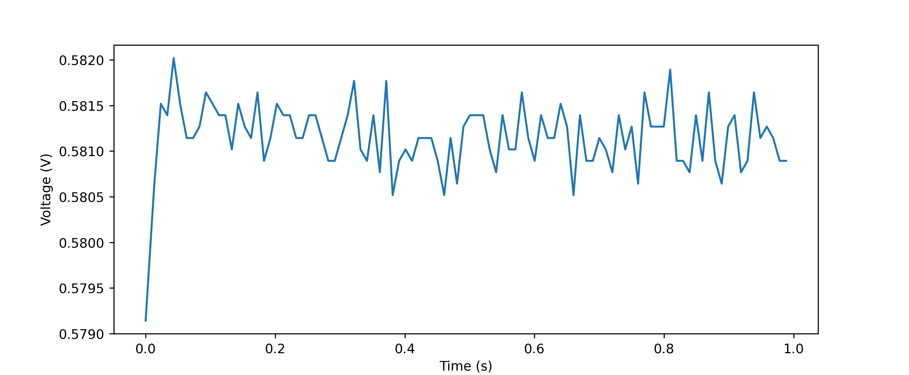

Develop
=====================

Making Test for devices with upydev/upydevice + pytest
------------------------------------------------------

Simple tests definitions
^^^^^^^^^^^^^^^^^^^^^^^^
Using `upydevice/test/ <https://github.com/Carglglz/upydevice/tree/master/test>`_ as a template
is easy to create custom tests for a device, to be run interactively, which can range
from entire modules to single functions, e.g.

.. note:: ``pytest`` and ``pytest-benchmark`` required. Install with
          ``$ pip install pytest pytest-benchmark``

Consider test ``test_blink_led`` from ``test_esp_serial.py``
This will test led ``on()`` and ``off()`` functions:

.. code-block:: python

  def test_blink_led():
    TEST_NAME = 'BLINK LED'
    if dev.dev_platform == 'esp8266':
        _ESP_LED = 2
    elif dev.dev_platform == 'esp32':
        _ESP_LED = 13

    _led = dev.cmd("'led' in globals()", silent=True, rtn_resp=True) # define led if not already defined
    if not _led:
        dev.cmd('from machine import Pin; led = Pin({}, Pin.OUT)'.format(_ESP_LED))

    for i in range(2):
        dev.cmd('led.on();print("LED: ON")')
        time.sleep(0.2)
        dev.cmd('led.off();print("LED: OFF")')
        time.sleep(0.2)
    try:
        assert dev.cmd('not led.value()', silent=True,
                       rtn_resp=True), 'LED is on, should be off'
        do_pass(TEST_NAME)
        print('Test Result: ', end='')
    except Exception as e:
        do_fail(TEST_NAME)
        print('Test Result: ', end='')
        raise e

or testing a module ``test_code.py`` in device that will test ``upylog.py`` logging functions.

Consider test ``test_run_script`` from ``test_esp_serial.py``

.. code-block:: python

  def test_run_script(): # the name of the test for pytest
    TEST_NAME = 'RUN SCRIPT' # the name of the test to display in log
    log.info('{} TEST: test_code.py'.format(TEST_NAME))
    dev.wr_cmd('import test_code', follow=True)
    try:
        assert dev.cmd('test_code.RESULT', silent=True,
                       rtn_resp=True) is True, 'Script did NOT RUN'
        dev.cmd("import sys,gc;del(sys.modules['test_code']);gc.collect()") # reloads module
        do_pass(TEST_NAME)
        print('Test Result: ', end='')
    except Exception as e:
        do_fail(TEST_NAME)
        print('Test Result: ', end='')
        raise e

So running this test

.. code-block:: console

  test $ upydev pytest test_esp_serial.py
  Running pytest with Device: sdev
  =========================================== test session starts ===========================================
  platform darwin -- Python 3.7.9, pytest-7.1.2, pluggy-1.0.0
  benchmark: 3.4.1 (defaults: timer=time.perf_counter disable_gc=False min_rounds=5 min_time=0.000005 max_time=1.0 calibration_precision=10 warmup=False warmup_iterations=100000)
  rootdir: /Users/carlosgilgonzalez/Desktop/MY_PROJECTS/MICROPYTHON/TOOLS/upydevice_.nosync/test, configfile: pytest.ini
  plugins: benchmark-3.4.1
  collected 7 items

  test_esp_serial.py::test_devname PASSED
  test_esp_serial.py::test_platform
  ---------------------------------------------- live log call ----------------------------------------------
  20:09:36 [pytest] [sdev] [ESP32] : Running SerialDevice test...
  20:09:36 [pytest] [sdev] [ESP32] : DEV PLATFORM: esp32
  SerialDevice @ /dev/cu.usbserial-016418E3, Type: esp32, Class: SerialDevice
  Firmware: MicroPython v1.19.1-285-gc4e3ed964-dirty on 2022-08-12; ESP32 module with ESP32
  CP2104 USB to UART Bridge Controller, Manufacturer: Silicon Labs
  (MAC: 30:ae:a4:23:35:64)
  20:09:37 [pytest] [sdev] [ESP32] : DEV PLATFORM TEST: [✔]
  Test Result: PASSED
  test_esp_serial.py::test_blink_led LED: ON
  LED: OFF
  LED: ON
  LED: OFF

  ---------------------------------------------- live log call ----------------------------------------------
  20:09:39 [pytest] [sdev] [ESP32] : BLINK LED TEST: [✔]
  Test Result: PASSED
  test_esp_serial.py::test_run_script
  ---------------------------------------------- live log call ----------------------------------------------
  20:09:39 [pytest] [sdev] [ESP32] : RUN SCRIPT TEST: test_code.py
  2022-08-17 19:09:38 [log_test] [INFO] Test message2: 100(foobar)
  2022-08-17 19:09:38 [log_test] [WARN] Test message3: %d(%s)
  2022-08-17 19:09:38 [log_test] [ERROR] Test message4
  2022-08-17 19:09:38 [log_test] [CRIT] Test message5
  2022-08-17 19:09:38 [None] [INFO] Test message6
  2022-08-17 19:09:38 [log_test] [ERROR] Exception Ocurred
  Traceback (most recent call last):
    File "test_code.py", line 14, in <module>
  ZeroDivisionError: divide by zero
  2022-08-17 19:09:38 [errorlog_test] [ERROR] Exception Ocurred
  Traceback (most recent call last):
    File "test_code.py", line 20, in <module>
  ZeroDivisionError: divide by zero
  20:09:40 [pytest] [sdev] [ESP32] : RUN SCRIPT TEST: [✔]
  Test Result: PASSED
  test_esp_serial.py::test_raise_device_exception
  ---------------------------------------------- live log call ----------------------------------------------
  20:09:40 [pytest] [sdev] [ESP32] : DEVICE EXCEPTION TEST: b = 1/0
  [DeviceError]:
  Traceback (most recent call last):
    File "<stdin>", line 1, in <module>
  ZeroDivisionError: divide by zero

  20:09:40 [pytest] [sdev] [ESP32] : DEVICE EXCEPTION TEST: [✔]
  Test Result: PASSED
  test_esp_serial.py::test_reset
  ---------------------------------------------- live log call ----------------------------------------------
  20:09:40 [pytest] [sdev] [ESP32] : DEVICE RESET TEST
  Rebooting device...
  Done!
  20:09:41 [pytest] [sdev] [ESP32] : DEVICE RESET TEST: [✔]
  Test Result: PASSED
  test_esp_serial.py::test_disconnect
  ---------------------------------------------- live log call ----------------------------------------------
  20:09:41 [pytest] [sdev] [ESP32] : DEVICE DISCONNECT TEST
  20:09:41 [pytest] [sdev] [ESP32] : DEVICE DISCONNECT TEST: [✔]
  Test Result: PASSED

  ============================================ 7 passed in 5.08s ============================================

Advanced tests definitions using yaml files
^^^^^^^^^^^^^^^^^^^^^^^^^^^^^^^^^^^^^^^^^^^
It is possible to use parametric test generation using yaml files e.g.
consider ``test_dev.py`` in `upydev/tests <https://github.com/Carglglz/upydev/tree/master/tests>`_.

Defining a test in a yaml file with the following directives:

.. admonition:: Test Directives

     - **name**: The name of the test
     - **hint**: Info about the test, description, context, etc.
     - **reset**: To reset the device (``soft`` or ``hard``) before running the test.
     - **load**: To load and execute a local file in device (.e.g ``test_basic_math.py``)
     - **command**: The command to run the test in device.
     - **args**: To pass argument to the test function in device.
     - **kwargs**: To pass keyword arguments to the test function in device.
     - **result**: The command to get test result.
     - **exp**: Expected result to assert.
     - **exp_type**: Expected type of result to assert.
     - **assert_op**: Assert operation if other than ``==``.
     - **assert_itr**: Assert elements of iterable result (``any``, or ``all``).
     - **benchmark**: To run a benchmark of the function (device time). (``pytest-benchmark`` plugin required)
     - **bench_host**: To capture benchmark time of device + host (total time)
     - **diff**: To compute diff between device and host benchmark times (i.e. interface latency)
     - **follow**: To follow device benchmark output only (host+device time).
     - **rounds**: Rounds to run the function if doing a benchmark.
     - **unit**: To specify units if the measure is other than time in seconds. (i.e sensors)
     - **network**: To run network tests, (currently only ``iperf3:server``, ``iperf3:client``)
     - **ip**: IP to use in network tests, (``localip``, or ``devip``)
     - **reload**: To reload a script in device so it can be run again .e.g reload ``foo_test`` module if command was ``import foo_test``.

.. note:: **load** can be a command too, .e.g ``import mytestlib`` although it won't return anything (only stdout).

.. tip:: Some directives are mutually exclusive, e.g. the 3 types of tests would be:

      - **Assert** Test: using **command**, **result**, **exp** (with options like **exp_type**, **assert_op**, **assert_itr**)
      - **Benchmark** Test: using **benchmark** with **rounds** and options like **bench_host**, **diff**, **follow**, **unit**...
      - **Network** Test: using **network**, **command**, **ip** to run network tests.

    The directives that should work with any type of test are the rest (
    **name**, **load**, **args**, **kwargs**, **hint**, **reload**, **reset**
    )

.. code-block:: yaml
    :caption: test_load_basic_math.yaml

    ---
      - name: "sum"
        load: ./dev_tests/test_basic_math.py
        command: "a = do_sum"
        args: [1, 1]
        result: a
        exp: 2

      - name: "diff"
        command: "a = do_diff"
        args: [1, 1]
        result: a
        exp: 0

      - name: "product"
        command: "a = do_product"
        args: [2, 2]
        result: a
        exp: 4

      - name: "division"
        command: "a = do_div"
        args: [1, 2]
        result: a
        exp: 0.5

.. code-block:: python
  :caption: ./dev_tests/test_basic_math.py

  def do_sum(a, b):
  return a + b

  def do_diff(a, b):
    return a - b

  def do_div(a, b):
    return a / b

  def do_product(a, b):
    return a * b

.. code-block:: console

  tests $ upydev pytest test_load_basic_math.yaml
  Running pytest with Device: pybV1.1
  ===================================================== test session starts =====================================================
  platform darwin -- Python 3.7.9, pytest-7.1.2, pluggy-1.0.0
  benchmark: 3.4.1 (defaults: timer=time.perf_counter disable_gc=False min_rounds=5 min_time=0.000005 max_time=1.0 calibration_precision=10 warmup=False warmup_iterations=100000)
  rootdir: /Users/carlosgilgonzalez/Desktop/MY_PROJECTS/MICROPYTHON/TOOLS/upydev_.nosync/tests, configfile: pytest.ini
  plugins: benchmark-3.4.1
  collected 7 items

  test_dev.py::test_devname PASSED
  test_dev.py::test_platform
  -------------------------------------------------------- live log call --------------------------------------------------------
  17:06:44 [pytest] [pybV1.1] [PYBOARD] : Running SerialDevice test...
  17:06:44 [pytest] [pybV1.1] [PYBOARD] : DEV PLATFORM: pyboard
  17:06:44 [pytest] [pybV1.1] [PYBOARD] : DEV PLATFORM TEST: [✔]
  Test Result: PASSED
  test_dev.py::test_dev[sum]
  -------------------------------------------------------- live log call --------------------------------------------------------
  17:06:44 [pytest] [pybV1.1] [PYBOARD] : Running [sum] test...
  17:06:44 [pytest] [pybV1.1] [PYBOARD] : Loading ./dev_tests/test_basic_math.py file...
  17:06:44 [pytest] [pybV1.1] [PYBOARD] : Command [a = do_sum(*[1, 1])]
  17:06:45 [pytest] [pybV1.1] [PYBOARD] : expected: 2 --> result: 2
  17:06:45 [pytest] [pybV1.1] [PYBOARD] : sum TEST: [✔]
  Test Result: PASSED
  test_dev.py::test_dev[diff]
  -------------------------------------------------------- live log call --------------------------------------------------------
  17:06:45 [pytest] [pybV1.1] [PYBOARD] : Running [diff] test...
  17:06:45 [pytest] [pybV1.1] [PYBOARD] : Command [a = do_diff(*[1, 1])]
  17:06:45 [pytest] [pybV1.1] [PYBOARD] : expected: 0 --> result: 0
  17:06:45 [pytest] [pybV1.1] [PYBOARD] : diff TEST: [✔]
  Test Result: PASSED
  test_dev.py::test_dev[product]
  -------------------------------------------------------- live log call --------------------------------------------------------
  17:06:45 [pytest] [pybV1.1] [PYBOARD] : Running [product] test...
  17:06:45 [pytest] [pybV1.1] [PYBOARD] : Command [a = do_product(*[2, 2])]
  17:06:45 [pytest] [pybV1.1] [PYBOARD] : expected: 4 --> result: 4
  17:06:45 [pytest] [pybV1.1] [PYBOARD] : product TEST: [✔]
  Test Result: PASSED
  test_dev.py::test_dev[division]
  -------------------------------------------------------- live log call --------------------------------------------------------
  17:06:45 [pytest] [pybV1.1] [PYBOARD] : Running [division] test...
  17:06:45 [pytest] [pybV1.1] [PYBOARD] : Command [a = do_div(*[1, 2])]
  17:06:45 [pytest] [pybV1.1] [PYBOARD] : expected: 0.5 --> result: 0.5
  17:06:45 [pytest] [pybV1.1] [PYBOARD] : division TEST: [✔]
  Test Result: PASSED
  test_dev.py::test_disconnect
  -------------------------------------------------------- live log call --------------------------------------------------------
  17:06:45 [pytest] [pybV1.1] [PYBOARD] : DEVICE DISCONNECT TEST
  17:06:45 [pytest] [pybV1.1] [PYBOARD] : DEVICE DISCONNECT TEST: [✔]
  Test Result: PASSED

  ====================================================== 7 passed in 1.76s ======================================================

.. note::

	``pytest`` command will by default use ``test_dev.py`` if only yaml files indicated

Running Benchmarks with pytes-benchmark
^^^^^^^^^^^^^^^^^^^^^^^^^^^^^^^^^^^^^^^
See `pytest-benchmark <https://pytest-benchmark.readthedocs.io/en/latest/index.html>`_ documentation

To write a benchmark test use **benchmark** directive to indicate a function that will be
called **rounds** times (default 5).
Consider this example:

.. code-block:: yaml
  :caption: test_pystone_bmk.yaml

    ---
    - name: System Check
      hint: "Device CPU frequency:"
      command: "import machine;machine.freq()"

    - name: Pystone Benchmark
      hint: Run 500 loops, returns time in seconds to complete a run.
      load: "import pystone_lowmem"
      benchmark: "pystone_lowmem.main"
      args: [500, True]
      reload: "pystone_lowmem"

Where the function ``pystone_lowmem.main(500,True)`` will perform a 500 loops run and
return the time that it took **in seconds**.

.. tip::

  Use of ``time.ticks_ms``/``time.ticks_us`` and ``time.ticks_diff`` to obtain the
  time that it takes to run any function and return time in seconds e.g.

  .. code-block:: python

    def benchmark_this(func, *args, **kwargs):
      t0 = time.ticks_ms()
      result = func(*args, **kwargs)
      delta = time.ticks_diff(time.ticks_ms(), t0)
      return delta/1e3 # delta/1e6 if using time.ticks_us

Running ``test_benchmark/test_pystone_bmk.yaml`` benchmark with different devices
and saving benchmark results

.. code-block:: console

    $ pyb pytest test_benchmark/test_pystones_bmk.yaml --benchmark-save=pyb_pystones
    ...
    $ gk32 pytest test_benchmark/test_pystones_bmk.yaml --benchmark-save=gk32_pystones
    ...
    $ sdev pytest test_benchmark/test_pystones_bmk.yaml --benchmark-save=sdev_pystones
    ...
    $ oble pytest test_benchmark/test_pystones_bmk.yaml --benchmark-save=oble_pystones
    ...

It is possible to compare benchmark results e.g.

.. code-block:: console

    $ pytest-benchmark compare "*pystone*"

    --------------------------------------------------------------------------------------------------- benchmark 'device': 4 tests ---------------------------------------------------------------------------------------------------
    Name (time in ms)                                                     Min                 Max                Mean            StdDev              Median               IQR            Outliers     OPS            Rounds  Iterations
    -----------------------------------------------------------------------------------------------------------------------------------------------------------------------------------------------------------------------------------
    test_dev[Pystone Benchmark]:[gkesp32@esp32] (0002_gk32_py)       188.0000 (1.0)      197.0000 (1.0)      192.8000 (1.0)      4.0249 (4.50)     195.0000 (1.0)      6.7500 (5.40)          2;0  5.1867 (1.0)           5           1
    test_dev[Pystone Benchmark]:[pybV1.1@pyboard] (0001_pyb_pys)     262.0000 (1.39)     264.0000 (1.34)     263.4000 (1.37)     0.8944 (1.0)      264.0000 (1.35)     1.2500 (1.0)           1;0  3.7965 (0.73)          5           1
    test_dev[Pystone Benchmark]:[oble@esp32] (0003_oble_py)          264.0000 (1.40)     267.0000 (1.36)     265.2000 (1.38)     1.3038 (1.46)     265.0000 (1.36)     2.2500 (1.80)          1;0  3.7707 (0.73)          5           1
    test_dev[Pystone Benchmark]:[sdev@esp32] (0004_sdev_py)          282.0000 (1.50)     292.0000 (1.48)     288.4000 (1.50)     3.9115 (4.37)     289.0000 (1.48)     4.7500 (3.80)          1;0  3.4674 (0.67)          5           1
    -----------------------------------------------------------------------------------------------------------------------------------------------------------------------------------------------------------------------------------

    Legend:
    Outliers: 1 Standard Deviation from Mean; 1.5 IQR (InterQuartile Range) from 1st Quartile and 3rd Quartile.
    OPS: Operations Per Second, computed as 1 / Mean

To see device firmware use ``--group-by=param``

.. code-block:: console

    $ pytest-benchmark compare "*pystone*" --group-by=param

    ---------- benchmark 'Pystone Benchmark @ esp32 micropython-v1.18-128-g2ea21abae-dirty on 2022-02-19 4MB/OTA BLE module with ESP32': 1 tests -----------
    Name (time in ms)                                                Min       Max      Mean  StdDev    Median     IQR  Outliers     OPS  Rounds  Iterations
    --------------------------------------------------------------------------------------------------------------------------------------------------------
    test_dev[Pystone Benchmark]:[oble@esp32] (0003_oble_py)     264.0000  267.0000  265.2000  1.3038  265.0000  2.2500       1;0  3.7707       5           1
    --------------------------------------------------------------------------------------------------------------------------------------------------------

    ------------ benchmark 'Pystone Benchmark @ esp32 micropython-v1.19.1-304-g5b7abc757-dirty on 2022-08-23 ESP32 module with ESP32': 1 tests -------------
    Name (time in ms)                                                Min       Max      Mean  StdDev    Median     IQR  Outliers     OPS  Rounds  Iterations
    --------------------------------------------------------------------------------------------------------------------------------------------------------
    test_dev[Pystone Benchmark]:[sdev@esp32] (0004_sdev_py)     282.0000  292.0000  288.4000  3.9115  289.0000  4.7500       1;0  3.4674       5           1
    --------------------------------------------------------------------------------------------------------------------------------------------------------

    -------------- benchmark 'Pystone Benchmark @ esp32 micropython-v1.19.1-321-gb9b5404bb on 2022-08-24 4MB/OTA SSL module with ESP32': 1 tests --------------
    Name (time in ms)                                                   Min       Max      Mean  StdDev    Median     IQR  Outliers     OPS  Rounds  Iterations
    -----------------------------------------------------------------------------------------------------------------------------------------------------------
    test_dev[Pystone Benchmark]:[gkesp32@esp32] (0002_gk32_py)     188.0000  197.0000  192.8000  4.0249  195.0000  6.7500       2;0  5.1867       5           1
    -----------------------------------------------------------------------------------------------------------------------------------------------------------

    ----------------- benchmark 'Pystone Benchmark @ pyboard micropython-v1.19.1-217-g5234e1f1e on 2022-07-29 PYBv1.1 with STM32F405RG': 1 tests ----------------
    Name (time in ms)                                                     Min       Max      Mean  StdDev    Median     IQR  Outliers     OPS  Rounds  Iterations
    -------------------------------------------------------------------------------------------------------------------------------------------------------------
    test_dev[Pystone Benchmark]:[pybV1.1@pyboard] (0001_pyb_pys)     262.0000  264.0000  263.4000  0.8944  264.0000  1.2500       1;0  3.7965       5           1
    -------------------------------------------------------------------------------------------------------------------------------------------------------------

    Legend:
    Outliers: 1 Standard Deviation from Mean; 1.5 IQR (InterQuartile Range) from 1st Quartile and 3rd Quartile.
    OPS: Operations Per Second, computed as 1 / Mean

To see the command/hint/context of the benchmark use ``--group-by=param:cmd``

.. code-block:: console

    $ pytest-benchmark compare "*pys*" --group-by=param:cmd

    benchmark "cmd={'name': 'Pystone Benchmark', 'hint': 'Run 500 loops, returns time in seconds to complete a run.', 'load': 'import pystone_lowmem', 'benchmark': 'pystone_lowmem.main(benchtm=True)', 'reload': 'pystone_lowmem'}": 4 tests
    Name (time in ms)                                                     Min                 Max                Mean            StdDev              Median               IQR            Outliers     OPS            Rounds  Iterations
    -----------------------------------------------------------------------------------------------------------------------------------------------------------------------------------------------------------------------------------
    test_dev[Pystone Benchmark]:[gkesp32@esp32] (0002_gk32_py)       188.0000 (1.0)      197.0000 (1.0)      192.8000 (1.0)      4.0249 (4.50)     195.0000 (1.0)      6.7500 (5.40)          2;0  5.1867 (1.0)           5           1
    test_dev[Pystone Benchmark]:[pybV1.1@pyboard] (0001_pyb_pys)     262.0000 (1.39)     264.0000 (1.34)     263.4000 (1.37)     0.8944 (1.0)      264.0000 (1.35)     1.2500 (1.0)           1;0  3.7965 (0.73)          5           1
    test_dev[Pystone Benchmark]:[oble@esp32] (0003_oble_py)          264.0000 (1.40)     267.0000 (1.36)     265.2000 (1.38)     1.3038 (1.46)     265.0000 (1.36)     2.2500 (1.80)          1;0  3.7707 (0.73)          5           1
    test_dev[Pystone Benchmark]:[sdev@esp32] (0004_sdev_py)          282.0000 (1.50)     292.0000 (1.48)     288.4000 (1.50)     3.9115 (4.37)     289.0000 (1.48)     4.7500 (3.80)          1;0  3.4674 (0.67)          5           1
    -----------------------------------------------------------------------------------------------------------------------------------------------------------------------------------------------------------------------------------

    Legend:
    Outliers: 1 Standard Deviation from Mean; 1.5 IQR (InterQuartile Range) from 1st Quartile and 3rd Quartile.
    OPS: Operations Per Second, computed as 1 / Mean

It is possible to benchmark measurements other than time, i.e. to benchmark sensor measurements.
Use ``unit`` directive in yaml file to indicate the unit or measurement and unit, e.g.
``unit: "V"`` or ``unit: "voltage:V"``. This also can be set at the command line with
``--unit`` option.

Let's consider this example to take measurements with an ADC sensor ``ADS1115``

.. code-block:: yaml
  :caption: test_ads/test_ads_bmk.yaml

  ---
  - name: i2c_config
    load: "from machine import I2C, Pin"
    command: "i2c=I2C"
    args: "[1]"
    kwargs: "{'scl': Pin(22), 'sda': Pin(23)}"

  - name: i2c_scan
    command: "addr=i2c.scan()"
    result: "i2c.scan()"
    exp: [72]
    exp_type: list

  - name: ads_config
    command: "from ads1115 import ADS1115;sensor=ADS1115(i2c,
             addr[0], 1); sensor.set_conv(7, channel1=0)"

  - name: ads_read
    command: "mv = sensor.raw_to_v(sensor.read())"
    result: mv
    exp: 0
    assert_op: "<="
    exp_type: float

  - name: ADS1115 Benchmark
    hint: Test ADS1115 ADC sensor
    load: "import time"
    benchmark: "[(time.time_ns(), sensor.raw_to_v(sensor.read())) for i in range(100)]"
    unit: "voltage:V"
    rounds: 1

.. code-block:: console

  $ espd pytest test_ads/test_ads_bmk.yaml --benchmark-save=espd_ads1115 --benchmark-save-data
  Running pytest with Device: espdev
  Comparing against benchmarks from: Darwin-CPython-3.7-64bit/0022_espd_ads1115.json
  ===================================================================================================================== test session starts =====================================================================================================================
  platform darwin -- Python 3.7.9, pytest-7.1.2, pluggy-1.0.0
  benchmark: 3.4.1 (defaults: timer=time.perf_counter disable_gc=False min_rounds=5 min_time=0.000005 max_time=1.0 calibration_precision=10 warmup=False warmup_iterations=100000)
  rootdir: /Users/carlosgilgonzalez/Desktop/MY_PROJECTS/MICROPYTHON/TOOLS/upydev_.nosync/tests, configfile: pytest.ini
  plugins: benchmark-3.4.1
  collected 8 items

  test_dev.py::test_devname PASSED
  test_dev.py::test_platform
  ------------------------------------------------------------------------------------------------------------------------ live log call ------------------------------------------------------------------------------------------------------------------------
  23:35:13 [pytest] [espdev] [ESP32] : Running WebSocketDevice test...
  23:35:13 [pytest] [espdev] [ESP32] : Device: esp32
  23:35:13 [pytest] [espdev] [ESP32] : Firmware: micropython v1.19.1-304-g5b7abc757-dirty on 2022-08-23; ESP32 module with ESP32
  23:35:13 [pytest] [espdev] [ESP32] : DEV PLATFORM TEST: [✔]
  Test Result: PASSED
  test_dev.py::test_dev[i2c_config]
  ------------------------------------------------------------------------------------------------------------------------ live log call ------------------------------------------------------------------------------------------------------------------------
  23:35:13 [pytest] [espdev] [ESP32] : Running [i2c_config] test...
  23:35:13 [pytest] [espdev] [ESP32] : Loading from machi... snippet
  paste mode; Ctrl-C to cancel, Ctrl-D to finish
  === from machine import I2C, Pin

  23:35:14 [pytest] [espdev] [ESP32] : Command [i2c=I2C(*[1], **{'scl': Pin(22), 'sda': Pin(23)})]
  23:35:14 [pytest] [espdev] [ESP32] : i2c_config TEST: [✔]
  Test Result: PASSED
  test_dev.py::test_dev[i2c_scan]
  ------------------------------------------------------------------------------------------------------------------------ live log call ------------------------------------------------------------------------------------------------------------------------
  23:35:14 [pytest] [espdev] [ESP32] : Running [i2c_scan] test...
  23:35:14 [pytest] [espdev] [ESP32] : Command [addr=i2c.scan()]
  23:35:15 [pytest] [espdev] [ESP32] : expected: list --> result: <class 'list'>
  23:35:15 [pytest] [espdev] [ESP32] : expected: [72] == result: [72]
  23:35:15 [pytest] [espdev] [ESP32] : i2c_scan TEST: [✔]
  Test Result: PASSED
  test_dev.py::test_dev[ads_config]
  ------------------------------------------------------------------------------------------------------------------------ live log call ------------------------------------------------------------------------------------------------------------------------
  23:35:15 [pytest] [espdev] [ESP32] : Running [ads_config] test...
  23:35:15 [pytest] [espdev] [ESP32] : Command [from ads1115 import ADS1115;sensor=ADS1115(i2c, addr[0], 1); sensor.set_conv(7, channel1=0)]
  23:35:16 [pytest] [espdev] [ESP32] : ads_config TEST: [✔]
  Test Result: PASSED
  test_dev.py::test_dev[ads_read]
  ------------------------------------------------------------------------------------------------------------------------ live log call ------------------------------------------------------------------------------------------------------------------------
  23:35:16 [pytest] [espdev] [ESP32] : Running [ads_read] test...
  23:35:16 [pytest] [espdev] [ESP32] : Command [mv = sensor.raw_to_v(sensor.read())]
  23:35:17 [pytest] [espdev] [ESP32] : expected: float --> result: <class 'float'>
  23:35:17 [pytest] [espdev] [ESP32] : expected: 0 <= result: 0.5788927
  23:35:17 [pytest] [espdev] [ESP32] : ads_read TEST: [✔]
  Test Result: PASSED
  test_dev.py::test_dev[ADS1115 Benchmark]
  ------------------------------------------------------------------------------------------------------------------------ live log call ------------------------------------------------------------------------------------------------------------------------
  23:35:17 [pytest] [espdev] [ESP32] : Running [ADS1115 Benchmark] test...
  23:35:17 [pytest] [espdev] [ESP32] : Loading import tim... snippet
  paste mode; Ctrl-C to cancel, Ctrl-D to finish
  === import time

  23:35:18 [pytest] [espdev] [ESP32] : Hint: Test ADS1115 ADC sensor
  23:35:18 [pytest] [espdev] [ESP32] : Benchmark Command [[(time.time_ns(), sensor.raw_to_v(sensor.read())) for i in range(100)]]
  [(715559717849154000, 0.5791427), (715559717862555000, 0.5806427), (715559717872601000, 0.5815177), (715559717882546000, 0.5813928), (715559717892413000, 0.5820178), (715559717902349000, 0.5815177), (715559717912478000, 0.5811427), (715559717922413000, 0.5811427), (715559717932291000, 0.5812678), (715559717942212000, 0.5816427), (715559717952415000, 0.5815177), (715559717962345000, 0.5813928), (715559717972224000, 0.5813928), (715559717982118000, 0.5810177), (715559717992065000, 0.5815177), (715559718002000000, 0.5812678), (715559718011880000, 0.5811427), (715559718021805000, 0.5816427), (715559718031787000, 0.5808928), (715559718041728000, 0.5811427), (715559718051652000, 0.5815177), (715559718061669000, 0.5813928), (715559718071616000, 0.5813928), (715559718081553000, 0.5811427), (715559718091440000, 0.5811427), (715559718101334000, 0.5813928), (715559718111284000, 0.5813928), (715559718121221000, 0.5811427), (715559718131099000, 0.5808928), (715559718140997000, 0.5808928), (715559718150945000, 0.5811427), (715559718160970000, 0.5813928), (715559718170853000, 0.5817678), (715559718180773000, 0.5810177), (715559718190747000, 0.5808928), (715559718200688000, 0.5813928), (715559718210567000, 0.5807677), (715559718220463000, 0.5817678), (715559718230410000, 0.5805177), (715559718240350000, 0.5808928), (715559718250236000, 0.5810177), (715559718260293000, 0.5808928), (715559718270243000, 0.5811427), (715559718280178000, 0.5811427), (715559718290054000, 0.5811427), (715559718299951000, 0.5808928), (715559718309908000, 0.5805177), (715559718319844000, 0.5811427), (715559718329721000, 0.5806427), (715559718339619000, 0.5812678), (715559718349568000, 0.5813928), (715559718359641000, 0.5813928), (715559718370132000, 0.5813928), (715559718380101000, 0.5810177), (715559718390056000, 0.5807677), (715559718399996000, 0.5813928), (715559718409886000, 0.5810177), (715559718419775000, 0.5810177), (715559718429732000, 0.5816427), (715559718439670000, 0.5811427), (715559718449554000, 0.5808928), (715559718459455000, 0.5813928), (715559718469707000, 0.5811427), (715559718479695000, 0.5811427), (715559718489586000, 0.5815177), (715559718499520000, 0.5812678), (715559718509505000, 0.5805177), (715559718519437000, 0.5813928), (715559718529372000, 0.5808928), (715559718539332000, 0.5808928), (715559718549288000, 0.5811427), (715559718559336000, 0.5810177), (715559718569478000, 0.5807677), (715559718579373000, 0.5813928), (715559718589322000, 0.5810177), (715559718599262000, 0.5812678), (715559718609149000, 0.5806427), (715559718619041000, 0.5816427), (715559718628992000, 0.5812678), (715559718638925000, 0.5812678), (715559718648820000, 0.5812678), (715559718658717000, 0.5818928), (715559718668752000, 0.5808928), (715559718678688000, 0.5808928), (715559718688632000, 0.5807677), (715559718698531000, 0.5813928), (715559718708483000, 0.5808928), (715559718718414000, 0.5816427), (715559718728302000, 0.5808928), (715559718738192000, 0.5806427), (715559718748135000, 0.5812678), (715559718758075000, 0.5813928), (715559718768006000, 0.5807677), (715559718778015000, 0.5808928), (715559718787963000, 0.5816427), (715559718797895000, 0.5811427), (715559718807782000, 0.5812678), (715559718817676000, 0.5811427), (715559718827620000, 0.5808928), (715559718837561000, 0.5808928)]

  23:35:20 [pytest] [espdev] [ESP32] : ADS1115 Benchmark TEST: [✔]
  Test Result: PASSED
  test_dev.py::test_disconnect
  ------------------------------------------------------------------------------------------------------------------------ live log call ------------------------------------------------------------------------------------------------------------------------
  23:35:20 [pytest] [espdev] [ESP32] : DEVICE DISCONNECT TEST
  23:35:20 [pytest] [espdev] [ESP32] : DEVICE DISCONNECT TEST: [✔]
  Test Result: PASSED
  Saved benchmark data in: /Users/carlosgilgonzalez/Desktop/MY_PROJECTS/MICROPYTHON/TOOLS/upydev_.nosync/tests/.benchmarks/Darwin-CPython-3.7-64bit/0023_espd_ads1115.json

  ------------------------------------------------------- benchmark 'device': 1 tests -------------------------------------------------------
  Name (voltage in mV)                                Min       Max      Mean  StdDev    Median     IQR  Outliers     OPS  Rounds  Iterations
  -------------------------------------------------------------------------------------------------------------------------------------------
  test_dev[ADS1115 Benchmark]:[espdev@esp32]     579.1427  582.0178  581.1515  0.3732  581.1427  0.5000      23;1  1.7207     100           1
  -------------------------------------------------------------------------------------------------------------------------------------------

  Legend:
    Outliers: 1 Standard Deviation from Mean; 1.5 IQR (InterQuartile Range) from 1st Quartile and 3rd Quartile.
    OPS: Operations Per Second, computed as 1 / Mean
  ===================================================================================================================== 8 passed in 13.40s ======================================================================================================================

.. tip:: **benchmark** directive accepts single value, a list of values or a list
    of 2 values tuples, where the first value is a time value and the second is the measurement to benchmark.

.. note:: To save benchmark results (i.e not only the stats) use ``--benchmark-save=[NAME] --benchmark-save-data``
    Data will be saved in ``.benchmarks/[SYSTEM PLATFORM]/xxxx_[NAME].json``, e.g.

.. code-block:: python
  :caption: plot.py

  import json
  from matplotlib import pyplot as plt
  import sys

  file = sys.argv[1]

  with open(file, 'r') as rp:
      report = json.load(rp)

  data = report['benchmarks'][0]['stats']['data']
  time_stamp = report['benchmarks'][0]['extra_info']['vtime']
  # from absolute timestamps in ns to relative time in seconds
  t_vec = [(t-time_stamp[0])/1e9 for t in time_stamp]

  plt.plot(t_vec, data)
  plt.ylabel("Voltage ($V$)")
  plt.xlabel("Time ($s$)")
  plt.show()

.. code-block:: console

  $ ./plot.py .benchmarks/Darwin-CPython-3.7-64bit/0023_espd_ads1115.json

Vim Integration
----------------
Here are some keybindings and commands to make it easier work with vim + upydev that 
can be added to `~/.vimrc`.

These commands and keybindings make it pretty easy to iterate and run/upload 
current file or blocks of code in device.

upload file to device
^^^^^^^^^^^^^^^^^^^^^
To upload current file to a device add this to `~/.vimrc`

.. code-block:: console
   
   " Terminal
   set shell=bash\ -l " make it use bash with ~/.profile or ~/.bash_rc 
   
   " UPYDEV
   
   " Upload current file to device
   command U !upydev put %:.
   
   " Upl <device> :Upload current file to <device>
   command! -nargs=1 Upl !upydev put %:. -@ <q-args>
   
   " Keybinding to upload current file to device
   noremap <C-i> :U<CR><CR>

   " Upload current file to device using an open terminal shell-repl
   command PutOnTerm :call term_list()[0]->term_sendkeys("put " .. expand('%:.') .."\<CR>")
   nnoremap <leader>u :PutOnTerm <CR><CR>

shell-repl
^^^^^^^^^^^^^^^^

To open shell-repl in a terminal window inside vim:

.. code-block:: console

   " Open terminal at bottom and open shell-repl  
   command Shl :bo term++rows=15 ++close upydev shl

   " Open terminal at bottom and open jupyter console with upydevice kernel
   command Jpy :bo term++rows=15 ++close upydev jupyterc

   " Command to run upydev pytest with current file 
   command Upyt !upydev pytest %:.

   " Keybinding to run Upyt command
   nnoremap <Leader>t :Upyt <CR>

   " Command to show upydev global group 
   command SG :bo term++rows=15 upydev gg
   
   " Sh <device> command to open a termial at the bottom with shell-repl @ <device>
   command! -nargs=1 Sh :bo term++rows=15 ++close upydev shl -@ <q-args>
   
   "St <device> :Set upydev global device config.
   command! -nargs=1 St !upydev set -g -@ <q-args>

run current file
^^^^^^^^^^^^^^^^

Run current file or lines of code in device

.. code-block:: console 

   " Keybinding to execute current file in device 
   nnoremap <C-f> :!upydev load <C-r>=expand('%:.')<cr> <CR>

   " Execute current line on an open terminal REPL 
   command ExecOnTerm :call term_list()[0]->term_sendkeys(getline('.') .. "\<CR>")
   nnoremap <leader>e :ExecOnTerm <CR><CR>

   " Execute current file on an open terminal shell-rep
   command LoadOnTerm :call term_list()[0]->term_sendkeys("load " .. expand('%:.') .."\<CR>")
   nnoremap <leader>l :LoadOnTerm <CR><CR>

   " Execute current line selection in an open terminal REPL
   command ExecBuffOnTerm :call term_list()[0]->term_sendkeys(join(getline(1,'$'), "\<cr>").."\<CR>")
   nnoremap <leader>r :ExecBuffOnTerm <CR><CR>

run test files
^^^^^^^^^^^^^^^^
Run current test file with upydev + pytest

.. code-block:: console 
 
   " Run current test file with upydev + pytest
   command Upyt !upydev pytest %:.
   nnoremap <Leader>T :Upyt<CR>
   
   " "" in terminal window below
   command Upytb :bo term++rows=15 upydev pytest %:.
   nnoremap <leader>t :Upytb <CR>

   " Run pytest of current file using an open terminal shell-repl
   command TestOnTerm :call term_list()[0]->term_sendkeys("pytest " .. expand('%:.') .."\<CR>")
   nnoremap <leader>y :TestOnTerm <CR><CR>

MicroPython (Unix)
^^^^^^^^^^^^^^^^^^^^^
Here are some commands/keybindings to integrate MicroPython (unix)

.. code-block:: console
    
    " MICROPYTHON
    
    " Command to run current file in MicroPython
    command Mr !micropython %:.
    
    " Same as before but stay at the REPL after executing the file.
    command Mi !micropython -i %:.

    " Open a terminal MicroPython REPL at the bottom
    command Upy :bo term++rows=15 ++close micropython

MicroPython stubs for code autocompletion
^^^^^^^^^^^^^^^^^^^^^^^^^^^^^^^^^^^^^^^^^^^^^^
* Micropython stubs:

  Stubs that enable code autocompletion of MicroPython modules. See
  `micropython-stubs <https://github.com/Josverl/micropython-stubs>`_.

* `YouCompleteMe`:
  
  plugin for vim autocompletion 
  see `ycm <https://github.com/ycm-core/YouCompleteMe>`_ and 
  `Python Semantic completion <https://github.com/ycm-core/YouCompleteMe#python-semantic-completion>`_

  e.g add ``.ycm_extra_conf.py`` to your project dir 

  .. code-block:: python

      def Settings(**kwargs):
        return {
            "sys_path": [
                (
                    "/<path-to>/micropython-stubs/stubs/micropython-v1_19_1-esp32"
                )
            ]
        }

 and this ``let g:ycm_extra_conf_globlist=['./*']``
 to ``~/.vimrc``

Git Integration
---------------------

Use git to track your device project and push changes to your device as it were a
remote git repository.

Init your project dir as a git repo 

``$ git init .``

Create a dir inside your project directory 
``$ mkdir <device>.git``

Init remote device "bare" repo
``$ cd <device>.git``
and 
``$ git --bare init``

Make device repo work as a server
``$ git --bare update-server-info``
and
``$ mv hooks/post-update.sample hooks/post-update``

Now go back to project dir, enable git ``pre-push`` hook to call ``upydev dsync`` and 
push changes to device.

.. code-block:: sh 

   $ cd ..
   $ vim .git/hooks/pre-push 

This hook checks that if remote repo that is been pushed is <device> (`gk32` in this example)
and calls ``upydev dsync`` to push commit changes to device.

.. code-block:: sh 

   #!/bin/sh

   # An example hook script to verify what is about to be pushed.  Called by "git
   # push" after it has checked the remote status, but before anything has been
   # pushed.  If this script exits with a non-zero status nothing will be pushed.
   #
   # This hook is called with the following parameters:
   #
   # $1 -- Name of the remote to which the push is being done
   # $2 -- URL to which the push is being done
   #
   # If pushing without using a named remote those arguments will be equal.
   #
   # Information about the commits which are being pushed is supplied as lines to
   # the standard input in the form:
   #
   #   <local ref> <local oid> <remote ref> <remote oid>
   #
   # This sample shows how to prevent push of commits where the log message starts
   # with "WIP" (work in progress).

   remote=$1

   if test $remote = "gk32" # change to match device remote repo
   then
           device=$(upydev -@ gkesp32) # change to match device name
           echo "Pushing to: "
           echo $device
           upydev dsync "git@main...gk32/main" -i "*.key" "./.git*" "./gk32.git*" "*.swp" "./.*" "*.der" "*.pem" "*config.py" -rf -@ gkesp32
           #                           ^- change to match device_repo/branch
   fi

   exit 0

.. note::

    Note that ``gk32`` is the remote device repo and ``-@ gkesp32`` is device name.
    Also note that ``-i`` flag is used to ignore files that will not be uploaded
    to device in any case.

Now create ``.gitignore``,
add device dir repo to it, e.g. ``gk32.git*`` plus any other unwanted file.

Add now device repo as a remote repo

``$ git remote add <device> <device>.git`` 

Check e.g.

.. code-block:: sh

    $ git remote -v
    gk32	gk32.git (fetch)
    gk32	gk32.git (push)`

Set upstream 

``$ git branch -u <device>/main``

Check

.. code-block:: sh 

   $ git remote show gk32
   + remote gk32
   Fetch URL: gk32.git
   Push  URL: gk32.git
   HEAD branch: main
   Remote branch:
     main tracked
   Local branch configured for 'git pull':
     main merges with remote main
   Local ref configured for 'git push':
     main pushes to main (fast-forwardable)
 

Make some changes, commit and check

.. code-block:: sh

   $ git status
   On branch main
   Your branch is ahead of 'gk32/main' by 1 commit.
     (use "git push" to publish your local commits)

   nothing to commit, working tree clean
   
   $ git branch -vv --all 
   * main              766d7fb [gk32/main: ahead 1] Test push
     remotes/gk32/main 56a43ba Fix log.exception with custom stream class

And finally push 

.. code-block:: sh

   $ git push gk32 
   Pushing to:
   Device: gkesp32 Address: gkesp32.local, Device Type: WebSocketDevice
   dsync: syncing path ./:
   dsync: dirs: OK[✔]
   dsync: syncing modified files (1):
   1. ./dummy.py [0.06 kB]

   ./dummy.py -> gkesp32:./dummy.py

   ./dummy.py [0.06 kB]
   ▏████████████████▏ \  100 % | 0.06/0.06 kB | 103.67 kB/s | 00:00/00:00 s

   dsync: files: OK[✔]
   0 new files, 1 file changed, 0 files deleted
   Enumerating objects: 5, done.
   Counting objects: 100% (5/5), done.
   Delta compression using up to 4 threads
   Compressing objects: 100% (3/3), done.
   Writing objects: 100% (3/3), 317 bytes | 317.00 KiB/s, done.
   Total 3 (delta 1), reused 0 (delta 0), pack-reused 0
   To gk32.git
       56a43ba..766d7fb  main -> main

Device development setups
-------------------------

SerialDevice
^^^^^^^^^^^^^
The easiest way to develop is having the device directly connected to the computer by USB.
It allows a fast develop/test/fix/deploy cycle. It is also possible to make the device act as
a peripheral so in can be integrated and controlled from the computer through a simple script,
command line tool (like upydev) or even a GUI app. This is also possible using
wireless connections, but this one has the lowest latency and the best performance.

To help with a fast development cycle, there are some tools/short-cuts/keybindings in ``shell-repl`` that allows
to load code from file into the device buffer to be executed. This is done using a tmp file ``_tmp_script.py`` in cwd.

- In **shell mode**:
  Pressing ``CTRL-t`` will load the contents of ``_tmp_script.py`` in device buffer and
  execute it. e.g. the file ``_tmp_script.py`` with content:

.. code-block:: python3

    import time
    for i in range(10):
        print(f"hello: {i}")
        time.sleep(0.1)

Pressing ``CTRL-t``

.. code-block:: console

      esp32@sdev:~ $ Running Buffer...
      hello: 0
      hello: 1
      hello: 2
      hello: 3
      hello: 4
      hello: 5
      hello: 6
      hello: 7
      hello: 8
      hello: 9

- In **repl mode**:
  Pressing ``CTRL-e`` will create/open file ``_tmp_script.py`` to be modified
  in ``vim``. After saving and exit, the content will be loaded in device buffer.
  Next, pressing ``CTRL-d`` will execute the buffer or ``CTRL-c`` to cancel.
  e.g.

Pressing ``CTRL-e``, saving and exit, then ``CTRL-d``:

.. code-block:: console

    Temp Buffer loaded do CTRL-D to execute or CTRL-C to cancel
    >>> Running Buffer...
    hello: 0
    hello: 1
    hello: 2
    hello: 3
    hello: 4
    hello: 5
    hello: 6
    hello: 7
    hello: 8
    hello: 9
    >>>

- Using **load** command in **shell mode**: This allows to load and execute local
  scripts in device. This loads a local file content in device buffer and executes it.

.. code-block:: console

  esp32@sdev:~ $ load dummy.py

  This is a dummy file for testing purpose

- Adding custom keybinding to vim to load current file.

  Add the following lines to ``~/.vimrc``
  
.. code-block:: console

  " Execute current file in device
  nnoremap <C-f> :!upydev load <C-r>=expand('%:r')<cr>.py <CR>

E.g map CTRL-f to load current file content in device buffer and execute it.
(must save the file first with ``:w``)

.. tip:: Device buffer is limited so if the file is too big it may be better to upload the
    file to the device or split the file in smaller ones.

.. note:: This is also avaible in the ``shell-repl`` for WebSocketDevices and BleDevices,
          however latency will be higher due to the nature of wireless connections, e.g
          higher latency of BleDevices if using a bluetooth headset at the same time.

WebSocketDevice
^^^^^^^^^^^^^^^
In `upyutils/network <https://github.com/Carglglz/upydev/tree/master/upyutils/network>`_
there are some modules that may be of help when developing devices that needs to be
connected and mantain a reliable connection.

Using ``wpa_supplicant.py`` module allows to the define a configuration file
``wpa_supplicant.config`` with known AP networks ssid:passwords and its function
e.g.

.. code-block:: json

  {"my_ssid": "my_pass", "my_ssid2": "my_pass2"}

``setup_network()`` will scan and connect to the closest known AP and return ``True`` if
connected.

.. code-block:: python

  import wpa_supplicant

  if wpa_supplicant.setup_network():
    print("Connected")
    # Now for example RTC can be set with ntptime.settime()
  else:
    # Enable device AP instead
    print("Enabling AP")

As a bonus to set mDNS host name of the device, add a file named ``hostname.py`` with
the name e.g. ``NAME = "mydevice"`` and it will be set by ``wpa_supplicant.setup_network()``
too. This allows to use ``mydevice.local`` instead of device IP address.

.. code-block:: console

  $ ping mydevice.local
  PING mydevice.local (192.168.1.53): 56 data bytes
  64 bytes from 192.168.1.53: icmp_seq=0 ttl=255 time=100.093 ms
  64 bytes from 192.168.1.53: icmp_seq=1 ttl=255 time=21.592 ms
  64 bytes from 192.168.1.53: icmp_seq=2 ttl=255 time=239.554 ms
  ^C
  --- mydevice.local ping statistics ---
  3 packets transmitted, 3 packets received, 0.0% packet loss
  round-trip min/avg/max/stddev = 21.592/120.413/239.554/90.135 ms

In case a device needs to be moved (e.g. is powered by battery or to change device location)
A network watchdog can be useful to reset and connect to a new AP or schedule a reconnection
attemp.

Module ``nwatchdog.py`` defines a  Network watchdog class that will init a WatchDog Timer
``WDT`` with a timeout of n+10 and a hardware ``Timer`` that will check every n seconds if WLAN is connected,
and feed the ``WDT`` if True. Therefore if WLAN is for any reason disconnected the
watchdog will not be fed and it will trigger a reset.

e.g. in combination with ``wpa_supplicant.py`` and ``config`` module.

.. code-block:: python

  from wpa_supplicant import setup_network
  from nwatchdog import WatchDog
  from watchdog_config import WATCHDOG
  from log_config import LOG
  import ntptime
  import upylog
  from hostname import NAME

  upylog.basicConfig(level=LOG.level, format='TIME_LVL_MSG')
  log = upylog.getLogger(NAME, log_to_file=True, rotate=5000)

  if setup_network():
    if WATCHDOG.enabled:
        wlan = network.WLAN(network.STA_IF)
        watch_dog = WatchDog(wlan)
        watch_dog.start()
        log.info('Network WatchDog started!')
    # Set time
    try:
        ntptime.settime()
    except Exception as e:
        log.exception(e, "NTP not available")

  else:
    # set AP

Module ``ursyslogger.py`` allows to forward logging messages to a remote host
using `rsyslog <https://github.com/rsyslog/rsyslog>`_ . Configure rsyslog in remote server
to enable remote logging using TCP, see `remote logging with rsyslog <https://www.makeuseof.com/set-up-linux-remote-logging-using-rsyslog/>`_.

Then add ``RsysLogger`` to ``log``.

.. code-block:: python

  ...
  >>> from ursyslogger import RsysLogger
  >>> rsyslog = RsysLogger("server.local", port=514, hostname="mydevice", t_offset="+01:00")
  >>> log.remote_logger = rsyslog
  >>> log.info("Remote hello")
  2022-09-15 10:06:04 [esp32@mydevice] [INFO] Remote hello

Then check in remote server e.g.

.. code-block:: console

  $ tail -F mydevice.local.log
  Sep 15 10:06:04 mydevice.local esp32@mydevice Remote hello

BleDevice
^^^^^^^^^
Once the device is running ``BleREPL`` with ``NUS`` profile (Nordic UART Service), it is possible
to connect and send commands as with other devices. However due to the nature of
Bluetooth Low Energy, the computer needs to scan first and then connect, which
depending on the advertising period of the device, it may take a bit. This is why connecting
to the device using ``shell-repl`` mode is the best way to work. (e.g in case the device cannot
be connected using USB/Serial i.e. no physical access.)
Using ``config`` module it is possible to set different operation modes that will switch
between:

 - Custom ble app/profile (e.g. ``Temeperature Sensor`` Profile)
 - Debug Mode, running ``BleREPL`` with ``NUS`` Profile.
 - Bootloader Mode, running ``DFU`` Profile to do OTA firmware updates.

Set mode config with, (in ``shell-repl``)

.. code-block:: console

    esp32@oble:~ $ config add mode
    esp32@oble:~ $ config mode: app=True blerepl=False dfu=False
    mode -> app=True, blerepl=False, dfu=False

and in ``main.py``:

.. code-block:: python

  from mode_config import MODE

  if MODE.app:
    print('App mode')
    import myapp
    myapp.run()

  elif MODE.blerepl:
    print('Debug mode')
    import ble_uart_repl
    ble_uart_repl.start()

  elif MODE.dfu:
    print('DFU mode')
    from otable import BLE_DFU_TARGET
    ble_dfu = BLE_DFU_TARGET()

.. note:: Note that while running in ``app`` or ``dfu`` mode to switch to another mode, it
  should be done by setting ``mode`` config using ``config`` module and then rebooting the device, using a custom writable characteristic in case of ``app`` mode, and in case of ``dfu`` mode after a timeout with no connections
  or OTA update successfully done (ideally switching to ``debug`` / ``blerepl`` mode to perform tests. After that
  set config to ``app`` mode and reboot)
